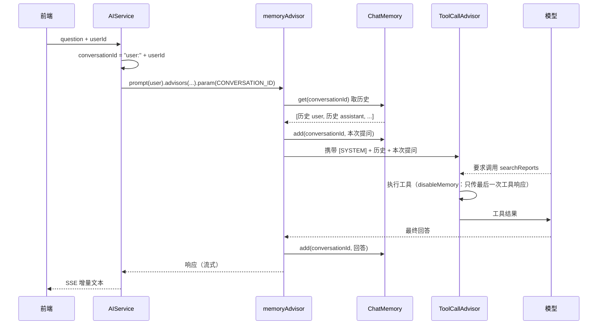

# 周报问答的记忆功能：设计、实现与类比

> 适用范围：本项目 `WeeklyReportManager`，Spring AI **1.1.8**（BOM 由 `pom.xml` 管理）。
> 涉及代码：`service/AIService.java`、`service/tool/ReportQueryTools.java`、`advisor/AILogAdvisor.java`。
> 官方依据：Spring AI Reference 1.1.8 — *Advisors API*、*Chat Memory*、*Tool Calling*。
> 配套阅读：`spring-ai-framework-overview.md`（框架地图）、`spring-ai-learning-plan.md`（学习路线）。

---

## 一、先建立直觉：一家「只看病历」的诊所

### 1.1 核心矛盾：这位医生每次都会失忆

把大模型想象成一位**医术极高、但每次见面都把你当陌生人**的医生。

- 他能瞬间理解你这次说的每句话，推理能力惊人；
- 但他**完全不记得上次你来过**——不是记性差，是**结构上就没有记忆**。

LLM 是无状态的：两次请求之间没有任何关联，上一次说了什么、模型自己上一轮答了什么，都不会自动"留在脑子里"。

所以这家诊所立了一条规矩：

> **每次就诊，你的全部病历必须先摊在诊台上，医生才开口。**

所谓"记忆功能"，解决的就是"**怎么把病历及时、完整、不多不少地摊上去**"。

### 1.2 六个角色一览

| 类比中的角色 | 真实组件 | 一句话职责 |
|---|---|---|
| 病历的**存放规则** | `ChatMemory`（`MessageWindowChatMemory`） | 决定留哪些消息、何时丢弃 |
| 那个**柜子本体** | `ChatMemoryRepository` | 实际存取消息 |
| **调档 + 归档**环节 | `MessageChatMemoryAdvisor` | 就诊前取历史、就诊后写新消息 |
| **病历号** | `conversationId` | 区分"谁的对话" |
| **别另开一本记录** | `ToolCallAdvisor.disableMemory()` | 避免工具循环和记忆重复记两份历史 |
| **只会失忆的医生** | `ChatModel`（DeepSeek） | 无状态，只读诊台上摊开的材料 |

---

## 二、逐个角色的真实身份

### 2.1 `ChatMemory` —— 病历的「存放规则」，不是柜子

它管的是**策略**：

```
一个病人最多留 20 页；
满了就撕掉最旧的；
系统提示词（诊所统一规范）不占病人页数。
```

对应实现是 `MessageWindowChatMemory`：维护一个**最多 N 条消息的滑动窗口**，默认 **20 条**。

**它只会"扔"，不会"压缩"。** 这一点非常关键：

| | 实际行为 |
|---|---|
| 超窗口的消息 | **整条丢弃，再也找不回来** |
| 是否做摘要 | ❌ 不做。没有"患者此前有高血压史"这种浓缩 |
| 是否保留 system | ✅ 保留 system 消息；新增 system 消息时会移除之前的 system 消息 |

**窗口大小没有配置属性。** 想从 20 改成别的值，只能自己定义一个 `ChatMemory` Bean 覆盖（自动配置带了 `@ConditionalOnMissingBean`）：

```java
@Bean
public ChatMemory chatMemory() {
    return MessageWindowChatMemory.builder().maxMessages(10).build();
}
```

### 2.2 `ChatMemoryRepository` —— 柜子本体

规则要有地方落地。柜子可以换：

| 柜子类型 | 实现 | 特点 |
|---|---|---|
| 诊室墙上的临时夹子 | `InMemoryChatMemoryRepository` | **应用重启即清空**（本项目所用） |
| 医院档案室 | `JdbcChatMemoryRepository` | 持久化到关系库 |
| 云档案库 | `Neo4j` / `Mongo` / `Cassandra` / `CosmosDB` | 分布式、可设 TTL、便于审计 |

**两层拆开的意义**：换柜子不影响规则，改规则不影响柜子。

> 所有仓库实现都按**时间正序（旧 → 新）**返回消息——这是 LLM 期望的对话历史格式。

### 2.3 `MessageChatMemoryAdvisor` —— 调档 + 归档环节

它既不是医生，也不是柜子，而是流程中一个固定动作：**在医生开口前调档，在医生说完后归档。**

它的读写点全在两个钩子里——项目注释点明了这一点：

```java
// 记忆的写入点正是它的 before()（写用户消息）和 after()（写回答），没进链就等于这一轮没发生过。
```

每轮问答，它被触发三次：

| 环节 | 动作 | 类比 |
|---|---|---|
| `before()` 前段 | 按 `conversationId` **取出**历史消息 | 护士把病历摊在诊台上 |
| `before()` 后段 | 把**本次提问**写入记忆 | 把挂号单钉进病历 |
| `after()` | 等模型答完，把**本次回答**写入记忆 | 把诊断结论补记上去 |

**最容易被忽略的一点**：医生（模型）从头到尾**没有碰过病历柜**。他看到的只是"诊台上摊开的那摞纸"——也就是被拼接进 prompt 的历史消息。**模型完全不知道"记忆"机制的存在**，它只是每轮都在读一份越来越长的材料。

> **1.1.x 的行为细节**：`before()` 会把 `SystemMessage` **移到消息列表最前面**，所以模型看到的是 `[SYSTEM, ...历史..., 本次提问]`。1.0.0 时代是 `[USER, ASSISTANT, SYSTEM, USER]`——系统消息被挤在历史之后。用 `AILogAdvisor` 打印一次就能看出这个顺序。

### 2.4 `conversationId` —— 病历号

```java
String conversationId = "user:" + request.getUserId();
```

一个用户一个号。用错时会出的事故很直观：

> 假如所有病人共用同一个病历号：你刚坐下，医生面前摊开的是**上一位病人**的完整病历。你接着说"我上次说的那个症状"，他能接上话——但接的是**别人的病史**。

**版本陷阱**：

| 版本 | `CONVERSATION_ID` 缺失时 |
|---|---|
| **1.1.5 及以前** | 回退到 `ChatMemory.DEFAULT_CONVERSATION_ID`（`"default"`）→ **等于全院共用一份病历** |
| **1.1.6 起（含本项目 1.1.8）** | 直接抛 `IllegalArgumentException("conversationId cannot be null")` |

同一改动还删掉了 `MessageChatMemoryAdvisor.Builder.conversationId(...)`——"默认会话 ID"这个口子被彻底封死，**会话隔离只能由调用方负责**。

### 2.5 `ToolCallAdvisor.disableMemory()` —— 「别另开一本记录」

医生有时让护士去查一项化验（调用工具），结果要回传给医生。

问题：`ToolCallAdvisor` 默认**自己也要维护一份完整的历史**（`conversationHistoryEnabled` 默认 `true`），在工具调用的多轮往返之间会自己攒一份对话。

而病历已经在 `memoryAdvisor` 手里记着了——**同一件事两本账**。

```java
this.toolCallAdvisor = ToolCallAdvisor.builder()
        .disableMemory()                  // 循环内的历史交给 memoryAdvisor 管，不要两份
        .suppressToolCallStreaming()      // 只把最终回答推给前端
        .build();
```

`disableMemory()` 让工具循环里**只传递最后一次工具响应**，历史统一交给病历去管。

### 2.6 窗口淘汰 —— 病历夹只夹 20 页

- 每轮问答占用 **2 条**消息（1 条提问 + 1 条回答）；
- 大约**第 10 轮之后**，最早的内容开始被丢弃；
- 用 `AILogAdvisor` 的日志可以直接看到"夹子里现在摊着哪几页"。

---

## 三、一轮问答的完整时序



**关键点：历史消息是"每轮重新拼进去"的。** 所谓"多轮上下文"，本质就是每次请求都把历史重发一遍——模型自己不保存任何东西。

---

## 四、六个关键设计决策

### 4.1 `memoryAdvisor` 不挂在共用的 `chatClient` 上

```java
// 日志 Advisor 挂在共用 client 上，五个入口的请求都会打出来。
this.chatClient = chatClientBuilder.defaultAdvisors(new AILogAdvisor(0)).build();
```

对比一下两者的挂法：

| Advisor | 挂载方式 | 覆盖范围 |
|---|---|---|
| `AILogAdvisor` | `defaultAdvisors(...)` | **五个入口全都过** |
| `memoryAdvisor` | 字段，在 `chatWithReports` 里按需挂 | **只有问答入口** |

原因：另外四个入口（草稿 / 润色 / 个人摘要 / 团队汇总）都是**一次性、无上下文**的调用。挂上记忆只会让它们被塞进一堆与本次任务无关的历史消息，纯属浪费 token。

### 4.2 `SystemMessage` 不进记忆

系统提示词每轮用 `.system(systemChatPrompt)` 单独传，不写入记忆。记忆只沉淀 **user / assistant** 两种消息，所以系统提示词不会随轮次累积。

### 4.3 周报原文不拼进 user 消息

```java
// 周报原文不再拼进 prompt：改成让模型用 ReportQueryTools 按需查，token 只花在真正被读到的那几周上。
// 但它仍然不能进用户消息——记忆只沉淀 user / assistant 两种消息（SystemMessage 不进记忆），
// 原文一旦拼进 user 消息就会被逐轮存进记忆，第 5 轮时模型要读 5 份完整原文，token 和延迟都是平方级上涨。
```

**为什么这是"平方级"**：

| 就诊次数 | 医生面前的病历厚度 |
|---|---|
| 第 1 次 | 1 份报告 |
| 第 3 次 | 3 份报告 |
| 第 5 次 | **5 份报告**（这一次也要把前 4 份从头读一遍） |

改成"工具按需查"之后，报告留在数据库/向量库里，只把真正需要的那几周取回来，而且**取回的内容出现在"工具响应"里，不会沉淀进记忆**。

这是**记忆机制与工具调用机制之间的一个耦合点**，很容易被忽略。

### 4.4 不做"空区间提前返回"的捷径

```java
// 这里故意不做「区间内没有周报就直接返回固定文案」的提前返回：
// 那条捷径会绕过 chatClient.prompt()，也就绕过了挂在链上的 MessageChatMemoryAdvisor——
// 记忆的写入点正是它的 before()（写用户消息）和 after()（写回答），没进链就等于这一轮没发生过。
// 用户接着追问「那上个月呢」时，模型看不到上一轮问过「有没有」，只能从零理解。
// 代价是「没数据」这一轮也要多走 1~2 次模型往返；空区间由 ReportQueryTools 告知模型后自然作答。
```

**"没数据"也是一次有效的就诊，必须留档。** 否则用户追问"那上个月呢"时，模型不知道上一轮问过什么。

### 4.5 `ToolCallAdvisor.disableMemory()`

见 2.5。核心是**避免两本账**。

### 4.6 `suppressToolCallStreaming()`

与记忆无关，但同属"流式 + 工具"的配合：

```java
// 显式写出来是因为 Builder 的字段默认值和它自己的 javadoc 说法不一致，不能赌——
// 工具调用那一轮的 chunk 一旦漏进 SSE，前端会把工具调用的 JSON 当正文渲染出来。
```

---

## 五、边界与限制

| 限制 | 说明 | 影响 |
|---|---|---|
| **窗口 20 条** | `MessageWindowChatMemory` 默认上限，超出**直接丢弃最旧**，不做摘要 | 约 10 轮后早期内容消失 |
| **工具中间消息不入记忆** | 官方明确：工具调用过程中的中间消息目前**不会**存入记忆（未来版本才解决） | 模型看不到"我上轮查过什么"，只能看到问答本身 |
| **重启即失** | `InMemoryChatMemoryRepository` 用 `ConcurrentHashMap` | 应用重启后所有人失忆 |
| **切用户 = 新会话** | `conversationId` 变了 | 看不到别人的，也看不到自己上次的（除非切回来） |
| **前端"清空"不清服务端记忆** | 只清聊天区 DOM | 关掉弹窗重开，仍能接着追问 |
| **无跨会话长期记忆** | 记忆按 `conversationId` 隔离，没有跨会话语义检索 | 想做"我记得你三个月前提过 X"，当前架构做不到 |

---

## 六、怎么验证

### 6.1 看日志里记忆是否注入

`AILogAdvisor` 的 `order = 0`，而 memory 的默认 order 落在 `HIGHEST_PRECEDENCE` 附近（负数），所以**日志 advisor 排在 memory 之后处理请求**——它打印的是**记忆注入后**的完整消息列表。

连续问两轮，第二轮应能看到：

```
│ [SYSTEM] 你是一名周报数据问答助手...
│ [USER] 第一轮的问题
│ [ASSISTANT] 第一轮的回答
│ [USER] 本轮问题
```

### 6.2 验证会话隔离

- **弱验证**：切到另一个用户提问，它不该知道前一个用户问过什么。（但这不能证明隔离生效，因为问题本身不含对方信息。）
- **强验证**：改 `conversationId`（比如临时加个时间戳后缀）再问同样的问题，记忆应该消失。

### 6.3 验证窗口淘汰

连问 11 轮以上（每轮 2 条，20 条约 10 轮），然后问第一轮的内容——应该答不上来。这个测试能直观感受到"20 条"的实际含义。

---

## 七、本项目代码索引

| 主题 | 位置 |
|---|---|
| `ChatMemory` 注入 + 自动配置说明 | `AIService` 构造器（第 116、129-133 行） |
| `memoryAdvisor` 字段及"不挂共用 client"的说明 | `AIService` 第 61-66 行 |
| `toolCallAdvisor` 的 `disableMemory` / `suppressToolCallStreaming` | `AIService` 第 68-79、134-137 行 |
| `conversationId` 的构造与传参 | `AIService#chatWithReports` 第 480、492-494 行 |
| "不做提前返回"的原因 | `AIService#chatWithReports` 第 469-473 行 |
| "原文不进 user 消息"的原因 | `AIService#chatWithReports` 第 475-477 行 |
| 工具与记忆的配合 | `ReportQueryTools`（工具结果不进记忆） |
| 日志 Advisor（观察记忆注入） | `advisor/AILogAdvisor.java` |

---

## 附：一句话速记

1. **模型没有记忆**，"多轮上下文"是每轮把历史重发一遍。
2. **`ChatMemory` 管规则，`ChatMemoryRepository` 管存放**；窗口 20 条，超出是**丢弃**不是摘要。
3. **读写都在 `MessageChatMemoryAdvisor` 的 `before()` / `after()`**——绕过 `chatClient.prompt()` 就等于这一轮没发生。
4. **`conversationId` 是隔离的唯一屏障**，1.1.6 起必传。
5. **大段原文走工具按需查，不要拼进 user 消息**——否则历史会平方级膨胀。
6. **窗口大小和 `disableMemory` 都只能通过自定义 Bean / Builder 调整**，没有配置属性。
