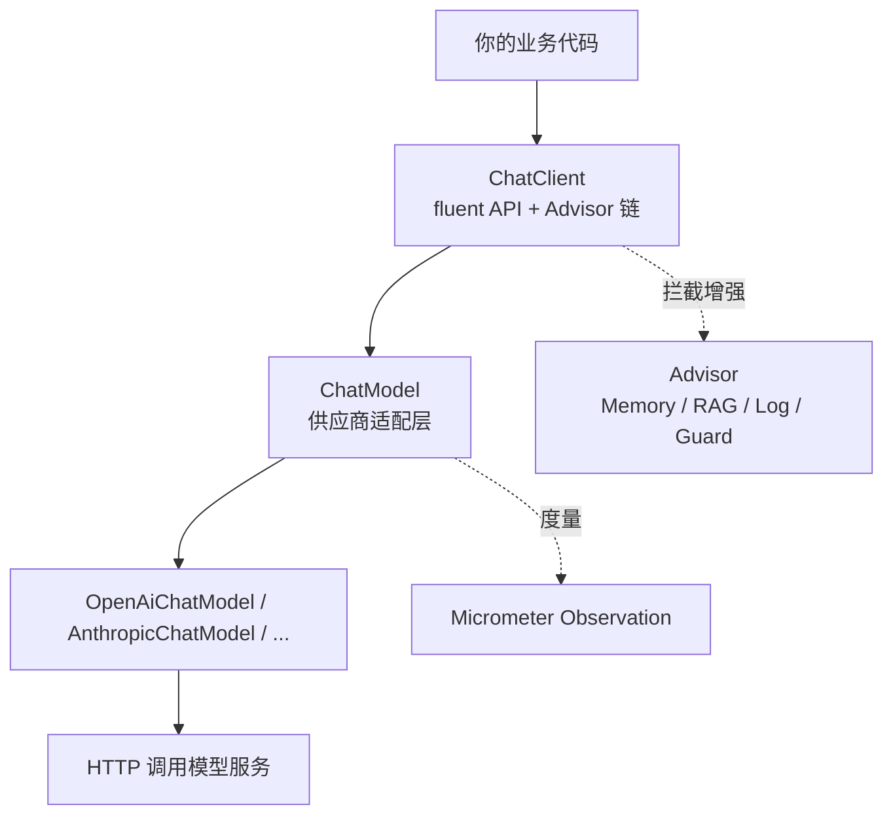
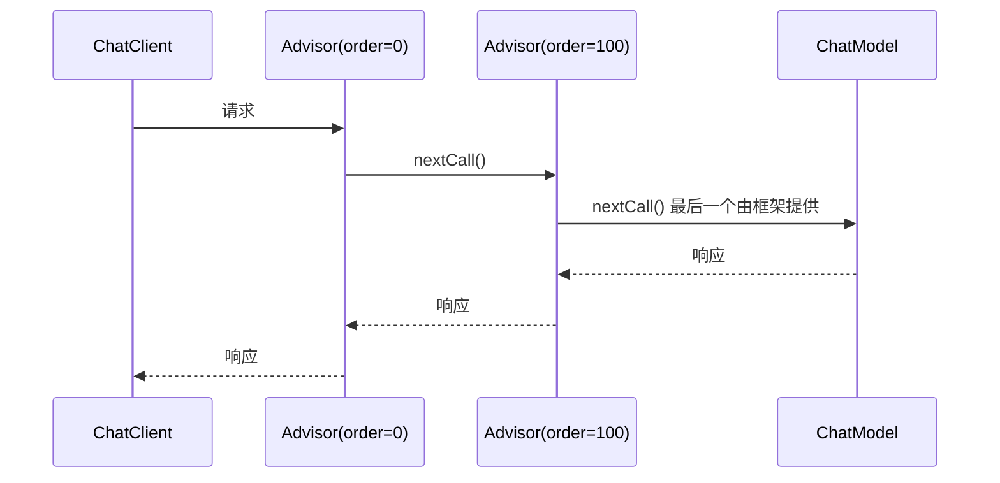
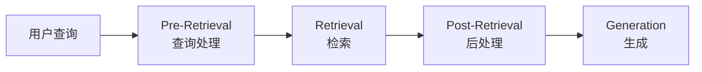

# Spring AI 框架重要内容总览

> 版本基线：**Spring AI 1.1.8**（本项目 `pom.xml` 所用），对应基线 Spring Boot 3.5.15 / JDK 17。
> 文档官网默认展示 **2.0.1**（基线 Spring Boot 4.1）。**本文所有 API 名称、属性名、默认值均以 1.1.8 为准**；凡是 2.0.x 独有的，会单独标注 `[2.0.x]`。
> 整理依据：官方 Reference 逐页核对（Chat Client / Advisors / Chat Memory / Tool Calling / Structured Output / Prompts / RAG / Observability 八章）。核对时间：2026-09-20。
> 与本目录 `spring-ai-learning-plan.md` 的分工：**那份是「按你的项目制定的学习路线」，本文是「框架本身的地图」**——先看这里建立全局观，再回那份排动手顺序。
> 官方入口：<https://docs.spring.io/spring-ai/reference/index.html>（记得用页面上的版本下拉切到 1.1.x）

---

## 一、框架定位

Spring AI 解决的问题只有一个：**把你的企业数据和 API 接进 AI 模型**。

它的设计灵感来自 Python 的 LangChain / LlamaIndex，但**不是移植**。核心设计目标：

| 目标 | 具体体现 |
|---|---|
| 可移植性 | 换模型供应商只改配置，不改业务代码 |
| 抽象分层 | 每个能力都有接口 + 多实现（如 `ChatMemoryRepository` 有 6 种实现） |
| 与 Spring 生态融合 | 自动配置、Starter、Micrometer 可观测性、`@Bean` |
| 应对 AI 的不确定性 | 结构化输出尽力而为、工具调用由应用侧执行 |

### 分层结构（理解框架的钥匙）



关键类比（官方原话）：

- `ChatModel` ≈ **JDBC 核心库**
- `ChatClient` ≈ **JdbcClient**（在 `ChatModel` 之上，通过 Advisor 提供记忆、RAG、agentic 行为）

> 换句话说：**`ChatModel` 只负责「发一次请求」，所有高级能力都在 `ChatClient` + Advisor 这一层。** 本项目 `AIService` 用的正是 `ChatClient`，路径是对的。

### 完整能力清单

| 能力 | 依赖/入口 | 本项目状态 |
|---|---|---|
| Chat（对话） | `spring-ai-starter-model-openai` | 已用 |
| Embedding（向量化） | `spring-ai-starter-model-*` 对应实现 | 未用 |
| Image（文生图） | 对应 starter | 未用 |
| Audio（语音转写 / TTS） | 对应 starter | 未用 |
| Moderation（内容审核） | 对应 starter | 未用 |
| Structured Output | 内置于 ChatClient | 已用 |
| Tool Calling | 内置于 ChatClient | 已用 |
| Advisors | `spring-ai-client-chat` | 已用 |
| Chat Memory | `spring-ai-autoconfigure-model-chat-memory`（starter 传递引入） | 已用 |
| RAG | `spring-ai-rag` / `spring-ai-advisors-vector-store` | 未用 |
| Vector Store | 各实现 starter | 未用 |
| MCP | `spring-ai-starter-mcp-*` | 未用 |
| Observability | `spring-boot-starter-actuator` | 未用 |
| Model Evaluation | `spring-ai-evaluation` | 未用 |

---

## 二、Prompts 与 Messages：最底层抽象

**官方定位**：Prompt 之于 AI，如同 **View 之于 Spring MVC**、如同**带占位符的 SQL**——一大段带变量的文本，运行时替换。

### 2.1 `Prompt` 类

`Prompt` = **有序的 `Message` 列表** + **`ChatOptions`**。

```java
public class Prompt implements ModelRequest<List<Message>> {
    private final List<Message> messages;
    private ChatOptions chatOptions;
}
```

**按角色取值的便捷方法**（多轮对话时很有用）：

| 方法 | 返回 |
|---|---|
| `getUserMessage()` | 最后一条 user 消息（不存在返回空 `UserMessage`） |
| `getSystemMessage()` | 第一条 system 消息（不存在返回空 `SystemMessage`） |
| `getLastUserOrToolResponseMessage()` | 最后一条 user 或 tool 响应消息 |
| `getUserMessages()` / `getSystemMessages()` | 全部对应角色的消息，保序 |

### 2.2 消息类型与角色

`Message` 接口 = **内容 + 元数据 Map + `MessageType`**。

```java
public interface Content {
    String getContent();
    Map<String, Object> getMetadata();
}

public interface Message extends Content {
    MessageType getMessageType();
}

// 多模态消息额外实现
public interface MediaContent extends Content {
    Collection<Media> getMedia();
}
```

| 角色 | `MessageType` | 含义 |
|---|---|---|
| System | `SYSTEM` | 引导模型行为与回复风格，相当于对话开始前的指令 |
| User | `USER` | 用户输入（提问 / 命令 / 陈述） |
| Assistant | `ASSISTANT` | 模型的响应；**也可能包含 Tool Call 请求信息** |
| Tool | `TOOL` | 针对 Tool Call 类 assistant 消息返回附加信息 |

### 2.3 `PromptTemplate` 与渲染器

```java
public interface TemplateRenderer extends BiFunction<String, Map<String, Object>, String> {
    String apply(String template, Map<String, Object> variables);
}
```

| 渲染器 | 说明 |
|---|---|
| `StTemplateRenderer` | **默认实现**，基于 Terence Parr 的 StringTemplate 引擎，变量语法 `{}` |
| `NoOpTemplateRenderer` | 不做任何模板处理 |

**自定义分隔符**（Prompt 内嵌 JSON 时避免 `{}` 冲突）：

```java
PromptTemplate.builder()
    .renderer(StTemplateRenderer.builder()
        .startDelimiterToken('<')
        .endDelimiterToken('>')
        .build())
    .template("Tell me 5 movies scored by <composer>.")
    .build();
```

**三个 Action 接口**（体现不同构造途径）：

| 接口 | 产出 |
|---|---|
| `PromptTemplateStringActions` | `String render()` / `render(Map)` |
| `PromptTemplateMessageActions` | `Message createMessage()` / `createMessage(List<Media>)` |
| `PromptTemplateActions` | `Prompt create()` / `create(Map, ChatOptions)` |

**从 `Resource` 加载模板**（本项目的做法）：

```java
@Value("classpath:/prompts/system-message.st")
private Resource systemResource;

SystemPromptTemplate systemPromptTemplate = new SystemPromptTemplate(systemResource);
```

> **要点**：`{userInput}` 这类占位符是在**本地**由 `StTemplateRenderer` 渲染完，再作为普通文本发给模型的。模型完全不知道"模板"这回事。
> **项目对应**：`resources/prompts/*.txt` + `.st`，`AIService` 构造器一次性读入内存。

### 2.4 Prompt Engineering 四要素

官方给出的组成：**Instructions（指令）+ External Context（外部上下文）+ User Input（用户输入）+ Output Indicator（输出指示）**。

> 官方特别提醒：**Output Indicator 不总是被遵守**——模型可能在 JSON 前加一句"here is your JSON"。这正是结构化输出必须兜底的原因。

### 2.5 Tokens 与成本

- 1 token ≈ **3/4 个英文单词**
- 输入（prompt）+ 输出（completion）**都计费**
- 响应元数据里带 token 用量——**这是唯一真实可信的成本度量**
- 超出上下文窗口的输入**不会被处理**

---

## 三、ChatClient API：日常主战场

### 3.1 创建方式

**自动配置**（最常用）：Spring Boot 提供一个 **prototype** 作用域的 `ChatClient.Builder` Bean。

```java
@RestController
class MyController {
    private final ChatClient chatClient;

    public MyController(ChatClient.Builder chatClientBuilder) {
        this.chatClient = chatClientBuilder.build();
    }
}
```

**多模型场景**：需关闭自动配置 `spring.ai.chat.client.enabled=false`，再手工建。

```java
// 同一模型类型的多个实例
ChatClient chatClient = ChatClient.create(myChatModel);
ChatClient custom = ChatClient.builder(myChatModel)
        .defaultSystemPrompt("You are a helpful assistant.")
        .build();

// 不同模型类型：@Bean + @Qualifier
@Bean
public ChatClient openAiChatClient(OpenAiChatModel chatModel) {
    return ChatClient.create(chatModel);
}
```

**多个 OpenAI 兼容端点**（接 DeepSeek、Groq 等）：用 `mutate()` 派生。

```java
OpenAiApi groqApi = baseOpenAiApi.mutate()
        .baseUrl("https://api.groq.com/openai")
        .apiKey(System.getenv("GROQ_API_KEY"))
        .build();
```

> **项目对应**：本项目只接了 DeepSeek 一个 OpenAI 兼容端点（`spring.ai.openai.base-url=https://api.deepseek.com`），所以直接注入 `ChatClient.Builder` 即可，`mutate()` 暂时用不上。

### 3.2 Fluent API 入口

| 方法 | 说明 |
|---|---|
| `prompt()` | 无参，逐项构建 |
| `prompt(Prompt prompt)` | 传入现成的 `Prompt` |
| `prompt(String content)` | 便捷方法，直接传用户文本 |

### 3.3 响应处理（**最易踩坑的一节**）

**`call()` 的返回选项：**

| 方法 | 返回 |
|---|---|
| `content()` | `String` |
| `chatResponse()` | `ChatResponse`（含多个 `Generation` + 元数据，**含 token 数**） |
| `chatClientResponse()` | `ChatClientResponse`（`ChatResponse` + **执行上下文**，如 RAG 检索到的文档） |
| `entity(Class<T>)` | 实体对象 |
| `entity(ParameterizedTypeReference<T>)` | 泛型集合，如 `List<ActorFilms>` |
| `entity(StructuredOutputConverter<T>)` | 用指定转换器 |
| `responseEntity(Class<T>)` | `ChatResponse` + 实体 |
| `responseEntity(ParameterizedTypeReference<T>)` | 同上，集合 |
| `responseEntity(StructuredOutputConverter<T>)` | 同上，指定转换器 |

> ⚠️ **官方明确的坑**：调用 `call()` **并不会真正触发模型**，它只声明"用同步方式"。**真正的调用发生在 `content()` / `chatResponse()` / `entity()` 等终结方法被调用时。**

**`stream()` 的返回选项：**

| 方法 | 返回 |
|---|---|
| `content()` | `Flux<String>` |
| `chatResponse()` | `Flux<ChatResponse>` |
| `chatClientResponse()` | `Flux<ChatClientResponse>` |

> ⚠️ **流式下没有直接返回实体的便捷方法**，需要显式用 `StructuredOutputConverter` 转换聚合结果。
> **项目对应**：`chatWithReports` 用 `.stream().content()` 得到 `Flux<String>`，正是官方推荐的流式写法。

### 3.4 默认配置（Builder 级 vs 运行时）

| Builder 级（`default` 前缀） | 运行时覆盖 |
|---|---|
| `defaultSystem(String)` / `defaultSystem(Consumer<SystemSpec>)` | `system(...)` |
| `defaultUser(...)` | `user(...)` |
| `defaultOptions(ChatOptions)` | `options(...)` |
| `defaultTools(...)` / `defaultToolNames(...)` | `tools(...)` / `toolNames(...)` |
| `defaultAdvisors(Advisor...)` / `defaultAdvisors(Consumer<AdvisorSpec>)` | `advisors(...)` |

**带参数的默认系统文本**：

```java
builder.defaultSystem("You are a friendly chatbot answering in the voice of a {voice}").build();
// 运行时：.system(sp -> sp.param("voice", voice))
```

> **项目对应**：`AIService` 构造器里 `.defaultAdvisors(new AILogAdvisor(0))` 就是 Builder 级默认——这让**五个入口的请求都会过一遍日志**。这是个正确的选择。

### 3.5 实现说明（架构约束，读源码前必看）

1. 自定义 `ChatModel` 实现时必须**同时配置 `RestClient` 与 `WebClient`**。
2. 因为 Spring Boot 3.4 的一个 bug，必须设置 **`spring.http.client.factory=jdk`**，否则默认 `reactor` 会破坏 `ImageModel` 等工作流。
3. **流式只支持 Reactive 栈**——命令式应用要流式就得引入 webflux。
4. **非流式只支持 Servlet 栈**——响应式应用要非流式就得引入 web。
5. **Tool calling 是命令式的（imperative）**，会造成阻塞工作流，也导致 Micrometer 观测部分中断（ChatClient span 与 tool calling span 不连通）。
6. 内置 Advisor 对标准调用执行**阻塞**操作，对流式调用执行**非阻塞**操作；其 Reactor Scheduler 可通过各 Advisor 的 Builder 配置。

---

## 四、Structured Output：把模型输出映射成 POJO

### 4.1 核心机制

转换器在**调用前后**各承担一部分工作：

- **调用前**：`FormatProvider` 向 Prompt 追加"格式指令"，引导模型按格式输出
- **调用后**：`Converter<String, T>` 把返回的纯文本解析成结构化类型

```java
public interface StructuredOutputConverter<T> extends Converter<String, T>, FormatProvider {}

public interface FormatProvider {
    String getFormat();
}
```

**追加到 Prompt 的格式指令长这样**：

```
Your response should be in JSON format.
The data structure for the JSON should match this Java class: java.util.HashMap
Do not include any explanations, only provide a RFC8259 compliant JSON response
following this format without deviation.
```

> ⚠️ **两条官方明确的限制**：
> 1. `StructuredOutputConverter` 只是**尽力而为（best effort）**——**模型不保证返回所要求的结构**，官方建议自行实现校验机制。
> 2. 该转换器**不用于 Tool Calling**，因为工具调用本身天然就是结构化输出。
>
> **这正是本项目三道防线（`limit` 截断 / `maskEmptyFields` / 判空）的官方依据。**

### 4.2 内置转换器

| 转换器 | 说明 |
|---|---|
| `BeanOutputConverter<T>` | 接收 Java 类或 `ParameterizedTypeReference`，生成 **DRAFT_2020_12 JSON Schema**，用 `ObjectMapper` 反序列化 |
| `MapOutputConverter` | RFC8259 合规 JSON → `Map<String, Object>` |
| `ListOutputConverter` | 逗号分隔列表 → `List`（需传 `ConversionService`） |
| `AbstractConversionServiceOutputConverter<T>` | 提供预配置 `GenericConversionService`，**无默认 FormatProvider** |
| `AbstractMessageOutputConverter<T>` | 提供预配置 `MessageConverter`，**无默认 FormatProvider** |

### 4.3 `.entity()` 用法

```java
record ActorsFilms(String actor, List<String> movies) {}

// 单个对象
ActorsFilms films = chatClient.prompt()
        .user(u -> u.text("Generate the filmography of 5 movies for {actor}.")
                    .param("actor", "Tom Hanks"))
        .call()
        .entity(ActorsFilms.class);

// 泛型集合
List<ActorsFilms> list = chatClient.prompt()
        .user("...")
        .call()
        .entity(new ParameterizedTypeReference<List<ActorsFilms>>() {});
```

**属性顺序控制**（对 record 和普通类都有效）：

```java
@JsonPropertyOrder({"actor", "movies"})
record ActorsFilms(String actor, List<String> movies) {}
```

> **项目对应**：`AIService#callForEntity` 用的就是 `.entity(type)`。注意官方说的"schema 会被追加到 system context"——这正是**为什么 `summarizeTeam` 要用 `TeamSummaryAI` 而不是 `TeamSummaryDTO`**：多一个 `missingMembers` 字段，就会让模型有机会自造名单。你的项目注释与官方结论完全一致。

### 4.4 原生结构化输出（Native Structured Output）

当模型原生支持时，可把 JSON Schema 直接交给模型的 native API，**无需在 Prompt 里追加格式指令**。可靠性更高、Prompt 更干净、性能更好。

```java
// 按次启用
chatClient.prompt()
    .advisors(AdvisorParams.ENABLE_NATIVE_STRUCTURED_OUTPUT)
    .user("Generate the filmography for a random actor.")
    .call()
    .entity(ActorsFilms.class);

// 全局启用
builder.defaultAdvisors(AdvisorParams.ENABLE_NATIVE_STRUCTURED_OUTPUT).build();
```

**支持原生结构化输出的模型**：OpenAI（GPT-4o 及之后）、Anthropic（Claude 3.5 Sonnet 及之后）、Vertex AI Gemini（1.5 Pro 及之后）、Mistral AI（Mistral Small 及之后）。

**限制**：部分模型（如 OpenAI）**不支持顶层对象数组**，此时需退回默认转换器。

> **版本注意**：`AdvisorParams.ENABLE_NATIVE_STRUCTURED_OUTPUT` 在 1.1.8 的 `ChatClient` 层是可用的；但 `entity(..., Consumer<EntityParamSpec>)`、`validateSchema()`、`useProviderStructuredOutput()` 这些**是 2.0.x 才有的**，1.1.8 不存在（细节见 `spring-ai-learning-plan.md` 第三节）。

### 4.5 各模型的内置 JSON 模式

| 模型 | 配置项 | 取值 |
|---|---|---|
| OpenAI | `spring.ai.openai.chat.options.responseFormat` | `JSON_OBJECT` 或 `JSON_SCHEMA` |
| Azure OpenAI | `spring.ai.azure.openai.chat.options.responseFormat` | `{ "type": "json_object" }` |
| Ollama | `spring.ai.ollama.chat.options.format` | `json` |
| Mistral AI | `spring.ai.mistralai.chat.options.responseFormat` | `{ "type": "json_object" }` / `{ "type": "json_schema" }` |

---

## 五、Advisors：框架最核心的扩展机制

### 5.1 它解决什么

Advisors 用于**拦截、修改、增强** AI 交互，把反复出现的生成式 AI 模式封装成可复用的组件。

典型上下文需求：
- **自有数据**：模型没训练过的数据（→ RAG Advisor）
- **对话历史**：Chat Model 是无状态的，历史必须每次随请求发送（→ Memory Advisor）

**推荐做法：在构建时（build time）通过 `defaultAdvisors()` 注册。**

### 5.2 核心接口

```java
public interface Advisor extends Ordered {
    String getName();
}

public interface CallAdvisor extends Advisor {
    ChatClientResponse adviseCall(ChatClientRequest req, CallAdvisorChain chain);
}

public interface StreamAdvisor extends Advisor {
    Flux<ChatClientResponse> adviseStream(ChatClientRequest req, StreamAdvisorChain chain);
}

public interface CallAdvisorChain extends AdvisorChain {
    ChatClientResponse nextCall(ChatClientRequest chatClientRequest);
    List<CallAdvisor> getCallAdvisors();
}
```

**五个核心组件**：

| 组件 | 用途 |
|---|---|
| `CallAdvisor` / `CallAdvisorChain` | 非流式场景 |
| `StreamAdvisor` / `StreamAdvisorChain` | 流式场景 |
| `ChatClientRequest` | 未封装的 Prompt 请求 |
| `ChatClientResponse` | Chat Completion 响应 |
| **advisor context** | 两者都持有，用于在链中**共享状态**（单次请求内传递） |

### 5.3 链的执行流程（6 步）

1. 框架用「用户 Prompt + 空 advisor context」创建 `ChatClientRequest`
2. 每个 advisor 处理请求（可修改），也可以**不调用下一个实体来阻断请求**（此时需自行填充响应）
3. 框架提供的**最后一个 advisor** 把请求发给 Chat Model
4. 响应沿链返回并转为 `ChatClientResponse`，**带上同一个共享 context 实例**
5. 每个 advisor 处理或修改响应
6. 最终 `ChatClientResponse` 提取 ChatCompletion 返回给客户端

### 5.4 执行顺序：栈模型（**最容易搞混的一节**）

这个"顺序与执行次序看似矛盾"的设计，本质是**栈**：

- **order 值小者先执行**
- 链中**第一个** advisor 是**最先处理请求**的，也是**最后处理响应**的
- `Ordered.HIGHEST_PRECEDENCE`（`Integer.MIN_VALUE`）→ 最先处理请求、最后处理响应
- `Ordered.LOWEST_PRECEDENCE`（`Integer.MAX_VALUE`）→ 最后处理请求、最先处理响应
- **多个 advisor order 相同时，执行顺序不保证**



> **项目对应**：`AILogAdvisor` 的 `order = 0`。按官方示例，memory advisor 的 order 落在 `HIGHEST_PRECEDENCE` 附近（负数），**比 0 小、先执行**，所以 log 排在它之后，看到的确实是「记忆注入后」的完整消息——项目注释的结论是对的。
> ⚠️ 这里有个**极易反过来的直觉**：order 小 = 排在前 = **先处理请求**。「排在前」指处理请求的顺序靠前，**不是「离模型更近」**。所以「想看别人加工后的结果」要给**更大**的 order。

### 5.5 内置 Advisors 全表

| 分类 | Advisor | 说明 |
|---|---|---|
| **Chat Memory** | `MessageChatMemoryAdvisor` | 记忆以**消息集合**形式加入（**推荐**；但并非所有模型都支持） |
| | `PromptChatMemoryAdvisor` | 记忆合并进 **system text**；**1.1.3 起已废弃** |
| | `VectorStoreChatMemoryAdvisor` | 从 **VectorStore** 检索记忆加入 system text |
| **Question Answering** | `QuestionAnswerAdvisor` | 向量存储问答，实现 **Naive RAG** |
| | `RetrievalAugmentationAdvisor` | 基于 `org.springframework.ai.rag` 构建块，实现 **Modular RAG** |
| **Reasoning** | `ReReadingAdvisor` | RE2 重读策略（论文 arXiv:2309.06275） |
| **Content Safety** | `SafeGuardAdvisor` | 防止生成有害/不适当内容 |
| **Logging** | `SimpleLoggerAdvisor` | 打印 request / response |

**日志 Advisor 的正确用法**：

```java
ChatResponse response = ChatClient.create(chatModel).prompt()
        .advisors(new SimpleLoggerAdvisor())
        .user("Tell me a joke?")
        .call()
        .chatResponse();
```

开启日志：`logging.level.org.springframework.ai.chat.client.advisor=DEBUG`

自定义日志内容：

```java
new SimpleLoggerAdvisor(
    Function<ChatClientRequest, String> requestToString,
    Function<ChatResponse, String> responseToString,
    int order
)
```

> **项目对应**：`AILogAdvisor` 是官方 `SimpleLoggerAdvisor` 的项目定制版。官方版本更简洁，你的版本多了"链式日志格式化"和工具往返追踪——两者思路一致。

### 5.6 实现自定义 Advisor（两种风格）

**风格一：直接实现 `CallAdvisor` + `StreamAdvisor`**（官方 `SimpleLoggerAdvisor` 示例）

```java
public class SimpleLoggerAdvisor implements CallAdvisor, StreamAdvisor {

    @Override
    public String getName() { return this.getClass().getSimpleName(); }

    @Override
    public int getOrder() { return 0; }

    @Override
    public ChatClientResponse adviseCall(ChatClientRequest req, CallAdvisorChain chain) {
        logRequest(req);
        ChatClientResponse resp = chain.nextCall(req);
        logResponse(resp);
        return resp;
    }

    @Override
    public Flux<ChatClientResponse> adviseStream(ChatClientRequest req, StreamAdvisorChain chain) {
        logRequest(req);
        Flux<ChatClientResponse> resps = chain.nextStream(req);
        return new ChatClientMessageAggregator()
                .aggregateChatClientResponse(resps, this::logResponse);
    }
}
```

> ⚠️ 流式下要用 `ChatClientMessageAggregator` 把 Flux 聚合成单个 `ChatClientResponse` 才能看完整响应；但**聚合是只读的，无法修改响应**。

**风格二：继承 `BaseAdvisor` 用 `before()` / `after()` 钩子**（更简洁）

```java
public class ReReadingAdvisor implements BaseAdvisor {

    private static final String DEFAULT_RE2_TEMPLATE = """
            {re2_input_query}
            Read the question again: {re2_input_query}
            """;

    @Override
    public ChatClientRequest before(ChatClientRequest req, AdvisorChain chain) {
        String augmented = PromptTemplate.builder()
                .template(this.re2AdviseTemplate)
                .variables(Map.of("re2_input_query", req.prompt().getUserMessage().getText()))
                .build()
                .render();

        return req.mutate()
                .prompt(req.prompt().augmentUserMessage(augmented))
                .build();
    }

    @Override
    public ChatClientResponse after(ChatClientResponse resp, AdvisorChain chain) {
        return resp;
    }

    @Override
    public int getOrder() { return this.order; }
}
```

**最佳实践**（官方给的 4 条）：

1. 保持 advisor **职责单一**
2. 需要时用 advisor context 在 advisor 之间共享状态
3. **同时实现流式与非流式版本**，获得最大灵活性
4. 仔细考虑链中顺序，确保数据流正确

### 5.7 API 演进史（看旧资料时会撞上）

| 阶段 | 接口名 |
|---|---|
| 1.0 M2 | `RequestAdvisor` / `ResponseAdvisor` |
| 1.0 M3 | `CallAroundAdvisor` / `StreamAroundAdvisor`（`StreamResponseMode` 被移除） |
| **1.0.0 起** | **`CallAdvisor` / `StreamAdvisor`**（`CallAroundAdvisorChain` → `CallAdvisorChain`） |
| 1.0.0 起 | `AdvisedRequest` → `ChatClientRequest`，`AdvisedResponse` → `ChatClientResponse` |

**Context Map 的变化**：1.0 M2 是独立可变参数；1.0 M3 起成为 record 的一部分、**不可变**，更新需调用 `updateContext()`（返回新的不可变 map）。

---

## 六、Chat Memory：让对话有上下文

### 6.1 概念区分（官方特别强调）

| 概念 | 含义 | 用什么 |
|---|---|---|
| **Chat Memory** | 模型为保持上下文而保留的信息（**可能只保留近期相关部分**） | `ChatMemory` |
| **Chat History** | 用户与模型交换的**全部**消息记录 | 建议自己用 Spring Data 等存储 |

> **`ChatMemory` 不是用来存完整历史的。** 要审计/回放，另建表。

### 6.2 两层抽象

```
ChatMemory          →  决定「保留哪些、何时移除」
    ↓
ChatMemoryRepository →  只负责「存取消息」
```

**自动配置**（本项目的情况）：

```java
@Autowired
ChatMemory chatMemory;   // 直接注入，无需自己 new
```

默认提供：
- 仓库：`InMemoryChatMemoryRepository`
- 记忆实现：`MessageWindowChatMemory`（**滑动窗口，默认 20 条**）

若应用中已配置其他仓库（JDBC / Cassandra / Neo4j 等），Spring AI 会**改用已有的那个**。两者都带 `@ConditionalOnMissingBean`，可自行覆盖。

> **项目对应**：`spring-ai-starter-model-openai` 会传递引入 `spring-ai-autoconfigure-model-chat-memory`，所以 `AIService` 直接注入 `ChatMemory` 就够了。**注意窗口大小没有配置属性**，想从 20 改成 10 只能自定义 `ChatMemory` bean。

### 6.3 `MessageWindowChatMemory` 的淘汰规则

```java
MessageWindowChatMemory memory = MessageWindowChatMemory.builder()
        .maxMessages(10)
        .build();
```

关键规则（**容易记错**）：
- 维护**最多 N 条**的滑动窗口，默认 20
- 超出时移除**最旧的消息**
- 但**保留 system 消息**
- 新增 system 消息时，**移除之前所有 system 消息**

### 6.4 存储实现全表

| 实现 | 依赖 artifact | 特点 |
|---|---|---|
| `InMemoryChatMemoryRepository` | 默认 | `ConcurrentHashMap`，重启即失 |
| `JdbcChatMemoryRepository` | `spring-ai-starter-model-chat-memory-repository-jdbc` | 关系库；支持 PostgreSQL / MySQL / MariaDB / SQL Server / HSQLDB / Oracle |
| `CassandraChatMemoryRepository` | `...-repository-cassandra` | 时间序列 schema，**支持 TTL**（建议设，如三年） |
| `Neo4jChatMemoryRepository` | `...-repository-neo4j` | 属性图；消息存为节点与关系 |
| `CosmosDBChatMemoryRepository` | `...-repository-cosmos-db` | 以 conversationId 为分区键 |
| `MongoChatMemoryRepository` | `...-repository-mongodb` | 文档存储；支持 TTL（秒，0 = 永久） |

**JDBC 仓库的配置属性**：

| 属性 | 说明 | 默认 |
|---|---|---|
| `spring.ai.chat.memory.repository.jdbc.initialize-schema` | `embedded` / `always` / `never` | `embedded` |
| `spring.ai.chat.memory.repository.jdbc.schema` | schema 脚本位置 | `classpath:.../schema-@@platform@@.sql` |
| `spring.ai.chat.memory.repository.jdbc.platform` | `@@platform@@` 占位符所用平台 | 自动探测 |

> 自动配置会创建 `SPRING_AI_CHAT_MEMORY` 表，**默认只对嵌入式库（H2 / HSQLDB / Derby）初始化**。用 Flyway/Liquibase 时设为 `never`。
> **所有仓库都按「旧 → 新」升序返回消息**——这是 LLM 期望的对话历史格式。

### 6.5 Memory Advisor 三选一

| Advisor | 机制 | 状态 |
|---|---|---|
| **`MessageChatMemoryAdvisor`** | 记忆作为**消息集合**加入 prompt | **推荐** |
| `PromptChatMemoryAdvisor` | 记忆以 XML 标签 + HTML 实体转义追加到 system prompt | **1.1.3 起废弃**，将移除 |
| `VectorStoreChatMemoryAdvisor` | 从 VectorStore 检索历史追加到 system message | 注意注入风险 |

```java
ChatMemory chatMemory = MessageWindowChatMemory.builder().build();

ChatClient chatClient = ChatClient.builder(chatModel)
        .defaultAdvisors(MessageChatMemoryAdvisor.builder(chatMemory).build())
        .build();
```

**迁移写法**（如果用了废弃的）：

```java
// Before (deprecated)
PromptChatMemoryAdvisor.builder(chatMemory).build();
// After (recommended)
MessageChatMemoryAdvisor.builder(chatMemory).build();
```

> ⚠️ **重要限制**：**工具调用过程中的中间消息目前不会存入记忆**，官方称未来版本解决。

**关于 `VectorStoreChatMemoryAdvisor` 的安全提示**（值得记）：检索内容会被 XML 转义并包成 `<memory-entry type="user">`，默认模板会指示模型把 `LONG_TERM_MEMORY` 当历史数据而非指令——**但这只是约定级控制，不能完全消除 prompt injection 风险**。对具备工具权限的 agent，官方建议改用 `MessageChatMemoryAdvisor`，把用户来源内容保持为**强类型 Message 对象**。

### 6.6 Conversation ID：**必传，无默认值**

```java
chatClient.prompt()
        .user("Do I have license to code?")
        .advisors(a -> a.param(ChatMemory.CONVERSATION_ID, conversationId))
        .call()
        .content();
```

> ⚠️ **`ChatMemory.CONVERSATION_ID` 对所有 memory advisor 都是必需的**。省略会抛 `IllegalArgumentException`——**没有默认会话 ID**。
> **版本细节**：这条在 **1.1.6 起**成立（`BaseChatMemoryAdvisor` 只剩 `getConversationId(Map)` 单参版本）；**1.1.5 及以前**会回退到 `ChatMemory.DEFAULT_CONVERSATION_ID`（`"default"`）。同一改动还删掉了 `MessageChatMemoryAdvisor.Builder.conversationId(...)`。
> **项目对应**：`AIService#chatWithReports` 用 `"user:" + userId` 作为 conversationId——**会话隔离由调用方负责**，这正是 1.1.6+ 的设计意图。

### 6.7 直接在 `ChatModel` 上用记忆（无 ChatClient 时）

必须**显式**管理：

```java
ChatMemory chatMemory = MessageWindowChatMemory.builder().build();
String conversationId = "007";

// 第一次
UserMessage userMessage1 = new UserMessage("My name is James Bond");
chatMemory.add(conversationId, userMessage1);
ChatResponse response1 = chatModel.call(new Prompt(chatMemory.get(conversationId)));
chatMemory.add(conversationId, response1.getResult().getOutput());

// 第二次
UserMessage userMessage2 = new UserMessage("What is my name?");
chatMemory.add(conversationId, userMessage2);
ChatResponse response2 = chatModel.call(new Prompt(chatMemory.get(conversationId)));
// 响应包含 "James Bond"
```

> 用 `ChatClient` 时这些都由 `MessageChatMemoryAdvisor` 代劳了——**这就是为什么该用 ChatClient**。

---

## 七、Tool Calling：让模型自己决定调什么

### 7.1 核心概念与安全边界

两种用途：

| 用途 | 说明 | 示例 |
|---|---|---|
| **信息检索** | 从数据库 / Web 服务 / 文件系统 / 搜索引擎取信息 | 查天气、查数据库记录 |
| **执行动作** | 在软件系统中执行操作 | 发邮件、写库、订票 |

> 🔐 **最重要的一条安全原则（官方原文）**：工具调用虽是模型能力，但**执行逻辑完全由客户端应用负责**。模型只能"请求调用并提供参数"，**模型永远无法访问被提供的任何 API**。

**调用流程 6 步**：

1. 应用在请求中附带工具定义（名称、描述、入参 schema）
2. 模型决定调用 → 返回工具名 + 按 schema 构造的参数
3. 应用用工具名定位并执行
4. 应用处理执行结果
5. 应用把结果回传给模型
6. 模型结合结果生成最终回答

**三个核心抽象**：

| 抽象 | 职责 |
|---|---|
| `ToolCallback` | 工具建模接口（定义 + 执行逻辑） |
| `ToolCallingManager` | 管理工具执行生命周期 |
| `ToolCallbackResolver` | 按名称动态解析工具 |

`ChatClient` 与 `ChatModel` 都接受 `ToolCallback` 列表。

### 7.2 `@Tool` 注解

```java
class DateTimeTools {
    @Tool(description = "Get the current date and time in the user's timezone")
    String getCurrentDateTime() {
        return LocalDateTime.now()
                .atZone(LocaleContextHolder.getTimeZone().toZoneId()).toString();
    }
}
```

| 属性 | 说明 |
|---|---|
| `name` | 工具名，缺省用方法名。**同一次请求内必须唯一**，同一类中不允许重名 |
| `description` | 工具描述。缺省用方法名，但**强烈建议显式提供**——描述不佳会导致模型该用不用、或用错 |
| `returnDirect` | 结果直返调用方还是回传模型 |
| `resultConverter` | `ToolCallResultConverter` 实现类，把返回值转成 String |

**方法约束**（很宽松）：
- 可 static 或实例方法，**任意可见性**（含 `private`）
- 类可为顶层或嵌套类
- 参数个数任意（含零参），支持基本类型、POJO、枚举、List、数组、Map 等
- 返回类型包括 `void`；**有返回值则必须可序列化**
- **AOT/GraalVM**：类是 Spring Bean（如 `@Component`）时自动支持；否则需 `@RegisterReflection(...)`

**JSON schema 自动生成。**

> **项目对应**：`ReportQueryTools` 是**手动 `new` 的非 Spring Bean**，所以 AOT 反射注册的约束用不上——这与官方说明一致。类注释里已经写明了这点。

### 7.3 `@ToolParam` 注解

```java
@Tool(description = "Set a user alarm for the given time")
void setAlarm(@ToolParam(description = "Time in ISO-8601 format") String time) { ... }
```

| 属性 | 说明 |
|---|---|
| `description` | 帮助模型理解参数格式、允许值 |
| `required` | 是否必填。**默认所有参数都是必填** |

**description 的优先级**：`@ToolParam` > `@JsonClassDescription` > `@JsonPropertyDescription` > `@Schema`

**required 的优先级**：
1. `@ToolParam(required = false)`
2. `@JsonProperty(required = false)`
3. `@Schema(required = false)`
4. `@Nullable`（Spring Framework）

> ⚠️ **官方强调**：正确设置 required 对**抑制幻觉**至关重要。**若参数本可为空却被标记为必填，模型很可能编造一个值。**

### 7.4 四种注册方式

**1. 声明式（`@Tool` 方法）**——最常用

```java
// 单次请求
chatClient.prompt("What day is tomorrow?").tools(new DateTimeTools()).call().content();

// 默认工具（跨所有基于同一 Builder 的 ChatClient 共享）
ChatClient.builder(chatModel).defaultTools(new DateTimeTools()).build();

// 手工生成
ToolCallback[] tools = ToolCallbacks.from(new DateTimeTools());
```

ChatModel 侧：

```java
ChatOptions options = ToolCallingChatOptions.builder()
        .toolCallbacks(ToolCallbacks.from(new DateTimeTools()))
        .build();
chatModel.call(new Prompt("What day is tomorrow?", options));
```

**2. 编程式 — `MethodToolCallback`**

```java
Method method = ReflectionUtils.findMethod(DateTimeTools.class, "getCurrentDateTime");
ToolCallback toolCallback = MethodToolCallback.builder()
        .toolDefinition(ToolDefinitions.builder(method)
                .description("Get the current date and time in the user's timezone")
                .build())
        .toolMethod(method)
        .toolObject(new DateTimeTools())   // static 方法可省略
        .build();
```

**3. 函数即工具 — `FunctionToolCallback`**

```java
public class WeatherService implements Function<WeatherRequest, WeatherResponse> {
    public WeatherResponse apply(WeatherRequest request) { return new WeatherResponse(30.0, Unit.C); }
}

ToolCallback toolCallback = FunctionToolCallback
        .builder("currentWeather", new WeatherService())
        .description("Get the weather in location")
        .inputType(WeatherRequest.class)
        .build();
```

> 函数与输入输出类型必须 **public**。

**4. 动态规格 — `@Bean` + `ToolCallbackResolver`**

```java
@Configuration(proxyBeanMethods = false)
class WeatherTools {
    public static final String CURRENT_WEATHER_TOOL = "currentWeather";

    @Bean(CURRENT_WEATHER_TOOL)
    @Description("Get the weather in location")
    Function<WeatherRequest, WeatherResponse> currentWeather() { ... }
}
```

Bean 名称即工具名，Spring 的 `@Description` 提供描述。此方式**不保证类型安全**（运行时解析）。注册用 `toolNames(...)` / `defaultToolNames(...)`。

> ⚠️ **重要**：如果同时提供默认工具与运行时工具，**运行时工具会完全覆盖默认工具**。默认工具在所有请求间共享，使用不当有风险。

> **项目对应**：`chatWithReports` 用的是 `.tools(new ReportQueryTools(...))`，属于"单次请求注册"——**每次请求都新建实例，天然避开了"默认工具跨请求共享"的坑**，同时把 `userId` / `start` / `end` 钉进实例字段。这是官方"默认工具 vs 运行时工具"这条限制下的正确选择。

### 7.5 已知限制（**必读**）

**方法工具不支持的参数/返回类型**：
- `Optional`
- 异步类型（`CompletableFuture`、`Future`）
- 响应式类型（`Flow`、`Mono`、`Flux`）
- 函数式类型（`Function`、`Supplier`、`Consumer`）

**函数工具不支持的输入/输出类型**：
- **基本类型**
- `Optional`
- **集合类型**（`List`、`Map`、`Array`、`Set`）
- 异步类型、响应式类型

> 注意：基本类型与集合类型在**基于方法的规格中是支持的**。

**其他限制**：
- 工具名在同一次请求内必须唯一
- 返回值必须可序列化
- 默认情况下，与模型交换的**内部工具执行消息不暴露给用户**

### 7.6 三种执行控制模式

框架提供**三种**递进的执行控制方式，这是本节最值得理解的结构：

| 模式 | 谁控制循环 | 特点 |
|---|---|---|
| **框架控制的执行**（默认） | `ChatModel` 内部 | 透明，但循环内的消息不经过 advisor 链 |
| **用户控制的执行** | 你的 `while` 循环 | 完全可控，可自定义历史管理 |
| **Advisor 控制的执行** | `ToolCallAdvisor` | **兼具可观测性与可控性（推荐）** |

**默认（框架控制）**：`ChatModel` 内部用 `ToolCallingManager` 透明接管。是否执行由 `ToolExecutionEligibilityPredicate` 判定：

```java
public class DefaultToolExecutionEligibilityPredicate implements ToolExecutionEligibilityPredicate {
    public boolean test(ChatOptions promptOptions, ChatResponse chatResponse) {
        return ToolCallingChatOptions.isInternalToolExecutionEnabled(promptOptions)
                && chatResponse != null && chatResponse.hasToolCalls();
    }
}
```

**用户控制**：设 `internalToolExecutionEnabled(false)`，自己循环：

```java
ChatResponse chatResponse = chatModel.call(prompt);
while (chatResponse.hasToolCalls()) {
    ToolExecutionResult result = toolCallingManager.executeToolCalls(prompt, chatResponse);
    prompt = new Prompt(result.conversationHistory(), chatOptions);
    chatResponse = chatModel.call(prompt);
}
```

**`ToolCallAdvisor`（本项目用的）**——把循环搬到 advisor 链上，同时**禁用模型的内部工具执行**。三大优势（官方原文）：

- **可观测性**：链上其他 advisor 可拦截观察每次工具调用迭代
- **与 Chat Memory 集成**：与对话历史管理无缝配合
- **可扩展性**：可定制工具调用行为

```java
var toolCallAdvisor = ToolCallAdvisor.builder()
        .toolCallingManager(toolCallingManager)
        .advisorOrder(BaseAdvisor.HIGHEST_PRECEDENCE + 300)
        .build();

var chatClient = ChatClient.builder(chatModel)
        .defaultAdvisors(toolCallAdvisor)
        .build();
```

| 配置项 | 说明 |
|---|---|
| `toolCallingManager` | 不提供则用默认实例 |
| `advisorOrder` | 须在 `HIGHEST_PRECEDENCE` 与 `LOWEST_PRECEDENCE` 之间 |
| `conversationHistoryEnabled` | 是否在工具调用迭代间维护完整对话历史，**默认 `true`** |

**对话历史管理**：
- 默认（`true`）：每次后续 LLM 调用都包含之前所有消息
- `.disableMemory()`：**只把最后一次工具响应消息传给下一轮**——适用于**已由 Chat Memory advisor 管理历史**的场景

```java
var chatMemoryAdvisor = MessageChatMemoryAdvisor.builder(chatMemory)
        .advisorOrder(BaseAdvisor.HIGHEST_PRECEDENCE + 200)   // 在 ToolCallAdvisor 之前
        .build();
var chatClient = ChatClient.builder(chatModel)
        .defaultAdvisors(chatMemoryAdvisor, toolCallAdvisor)
        .build();
```

> **项目对应**：`AIService` 的 `ToolCallAdvisor.builder().disableMemory()...build()` **完全对应官方这个示例**——因为记忆交给 `MessageChatMemoryAdvisor` 管，不要两份。代码注释里"不要两份"的说法，官方原文是 `disableMemory()` 用于 "already managed by Chat Memory advisor" 的场景。
>
> **关于 order**：官方示例显式给 memory 设了 `HIGHEST_PRECEDENCE + 200`、toolCall 设了 `HIGHEST_PRECEDENCE + 300`，即 **memory 先于 toolCall 执行**。项目里 memory 用的是默认 order（未显式设置），可以按栈模型核对一次默认值落在哪个位置，再决定是否需要像官方那样显式固定。

### 7.7 其他重要特性

**结果转换**：

```java
@FunctionalInterface
public interface ToolCallResultConverter {
    String convert(@Nullable Object result, @Nullable Type returnType);
}
```

默认用 `DefaultToolCallResultConverter`（Jackson 序列化为 JSON）。可通过 `@Tool(resultConverter = ...)` 等自定义。

> **项目对应**：`PlainTextResultConverter` 就是自定义 `ToolCallResultConverter` 的实现——为了让周报正文以纯文本而非 JSON 形式交给模型，省 token。

**工具上下文（`ToolContext`）**——**关键：其中的数据不会发给模型**

```java
@Tool(description = "Retrieve customer information")
Customer getCustomerInfo(Long id, ToolContext toolContext) {
    return customerRepository.findById(id, toolContext.getContext().get("tenantId"));
}
```

使用：`chatClient...toolContext(Map.of("tenantId", "acme"))`。默认与运行时 ToolContext 会**合并，运行时优先**。

> **这条对本项目极有参考价值**：`ReportQueryTools` 目前是把 `userId` / `start` / `end` 钉进**构造器字段**（完全不进 schema）。官方还提供了 `ToolContext` 这条"不进 schema 但走参数注入"的路径。两种都能实现"模型看不见"，区别是构造器字段是**实例级不可变**、`ToolContext` 是**请求级可传**。当前做法更安全（连参数位都没有）。

**Return Direct**：
- 默认工具结果回传模型；设为 `true` 则直接返回调用方
- 适用于 RAG 工具（避免多余后处理）或需要结束 agent 推理循环的工具
- ⚠️ **若一次请求有多个工具调用，必须所有工具的 `returnDirect` 都为 `true` 才会直接返回**

**异常处理**：
- 工具失败抛 `ToolExecutionException`
- `ToolExecutionExceptionProcessor` 决定：把错误消息回传模型，还是抛给调用方
- 默认实现 `DefaultToolExecutionExceptionProcessor`：**RuntimeException 的错误消息回传模型；受检异常与 Error（如 `IOException`、`OutOfMemoryError`）一律抛出**
- 配置属性：`spring.ai.tools.throw-exception-on-error`，**默认 `false`**

> **项目对应**：`ReportQueryTools#getReport` 中「日期越界时返回一句人能读懂的提示而不是抛异常」——这正是官方"错误消息回传模型让其处理"的思路（默认 `throw-exception-on-error=false`）。

**工具解析**：默认 `DelegatingToolCallbackResolver`，委托给：
- `SpringBeanToolCallbackResolver`：从 `Function` / `Supplier` / `Consumer` / `BiFunction` 类型的 Bean 解析
- `StaticToolCallbackResolver`：从静态 `ToolCallback` 列表解析

**工具参数增强**：`AugmentedToolCallbackProvider` 可动态为工具 schema 增加额外参数（如推理过程、置信度、多 agent 协调信号），无需改底层实现。

**可观测性**：
- `spring.ai.tool` observations 度量耗时并传播 tracing
- 可选择导出工具调用参数与结果为 span 属性（**默认关闭**）
- 主要操作以 **DEBUG** 级别记录在 `org.springframework.ai` 包下

> **升级提示**：`FunctionCallback` 已弃用，应迁移到 `ToolCallback` API。

---

## 八、RAG：检索增强生成

### 8.1 它解决什么

克服 LLM 在**长文本处理、事实准确性、上下文感知**方面的局限。

Spring AI 提供两种用法：**开箱即用的 Advisor** 与 **模块化自组装**。

### 8.2 方案一：`QuestionAnswerAdvisor`（Naive RAG）

**依赖**：

```xml
<dependency>
   <groupId>org.springframework.ai</groupId>
   <artifactId>spring-ai-advisors-vector-store</artifactId>
</dependency>
```

**流程**：用户提问 → 查 VectorStore 找相关文档 → 检索结果附加到用户文本作为上下文 → 交给模型

```java
ChatResponse response = ChatClient.builder(chatModel)
        .build().prompt()
        .advisors(QuestionAnswerAdvisor.builder(vectorStore).build())
        .user(userText)
        .call()
        .chatResponse();
```

**检索配置（`SearchRequest`）**：

```java
var qaAdvisor = QuestionAnswerAdvisor.builder(vectorStore)
        .searchRequest(SearchRequest.builder().similarityThreshold(0.8d).topK(6).build())
        .build();
```

**运行时动态过滤**：

```java
.advisors(a -> a.param(QuestionAnswerAdvisor.FILTER_EXPRESSION, "type == 'Spring'"))
```

**自定义模板**：模板**必须包含两个占位符** —— `query`（用户问题）与 `question_answer_context`（检索到的上下文）。

> ⚠️ 区分：Advisor 的 `.promptTemplate()` ≠ ChatClient 的 `.templateRenderer()`。
> `.userTextAdvise()` 已弃用，改用 `.promptTemplate()`。

### 8.3 方案二：`RetrievalAugmentationAdvisor`（Modular RAG）

**依赖**：

```xml
<dependency>
   <groupId>org.springframework.ai</groupId>
   <artifactId>spring-ai-rag</artifactId>
</dependency>
```

**Naive RAG 写法**：

```java
Advisor retrievalAugmentationAdvisor = RetrievalAugmentationAdvisor.builder()
        .documentRetriever(VectorStoreDocumentRetriever.builder()
                .similarityThreshold(0.50)
                .vectorStore(vectorStore)
                .build())
        .build();
```

**空上下文处理**：**默认不允许检索上下文为空**（此时指示模型不作答）；可用 `ContextualQueryAugmenter.builder().allowEmptyContext(true)` 放行。

### 8.4 模块化 RAG 四阶段（灵感来自《Modular RAG》论文）



**Pre-Retrieval（查询处理）**：

| 模块 | 说明 |
|---|---|
| `CompressionQueryTransformer` | 对话历史 + 追问 → 压缩成独立查询（**长对话必用**） |
| `RewriteQueryTransformer` | 重写冗长/含糊的查询 |
| `TranslationQueryTransformer` | 翻译成嵌入模型支持的目标语言 |
| `MultiQueryExpander` | 扩展为多个语义变体（默认含原查询，可用 `includeOriginal(false)` 关闭） |

> 💡 **重要建议**：使用 QueryTransformer 时，建议把 `ChatClient.Builder` 的 **temperature 设为较低值（如 0.0）**——默认温度对检索质量来说通常过高。

**Retrieval（检索）**：

- `VectorStoreDocumentRetriever`：语义相似检索，支持元数据过滤、相似度阈值、topK
- 过滤表达式**静态或动态**（支持 `Supplier`，可用于多租户）：

```java
.filterExpression(() -> new FilterExpressionBuilder()
        .eq("tenant", TenantContextHolder.getTenantIdentifier())
        .build())
```

- 也可通过 `Query` 的 `FILTER_EXPRESSION` 传**请求级**过滤；**若同时提供，请求级优先**
- **`ConcatenationDocumentJoiner`**：多查询/多数据源结果合并，**重复文档保留首次出现**，分数不变

**Post-Retrieval（后处理）**：应对 lost-in-the-middle、上下文长度限制、噪声冗余
- 按相关性**重排序**
- 移除无关/冗余文档
- **压缩**文档内容

**Generation（生成）**：
- `ContextualQueryAugmenter`：用检索文档增强用户查询
- 可通过 `promptTemplate()` 与 `emptyContextPromptTemplate()` 自定义

### 8.5 VectorStore 与 ETL

- VectorStore 是 RAG 的数据基础，**需预先加载数据**
- **过滤表达式跨所有 VectorStore 可移植**（SQL 风格）
- 官方支持 20+ 种实现：Azure AI、Chroma、Elasticsearch、Milvus、PGvector、Pinecone、Qdrant、**Redis**、Weaviate、MongoDB Atlas、Neo4j、OpenSearch、Oracle、MariaDB、GemFire、Typesense、S3、Couchbase、Cassandra 等
- **ETL Pipeline**：`DocumentReader` → `DocumentTransformer` → `DocumentWriter`（本页仅导航提及，细节需看子页）

> **项目对应**：项目已有 Redis（`spring-boot-starter-data-redis` + Redisson），**不用新增中间件就能跑 Redis VectorStore**。`MAX_PROMPT_REPORT_CHARS = 4000` 带来的"更早的周报排不下"，正是 RAG 要解决的场景。

---

## 九、Observability：度量与追踪

**启用方式极简**：加依赖即可，**无需写 Java 代码**。

```xml
<dependency>
  <groupId>org.springframework.boot</groupId>
  <artifactId>spring-boot-starter-actuator</artifactId>
</dependency>
```

**被观测的五类组件**：`ChatClient`（含 Advisor）、`ChatModel`、`EmbeddingModel`、`ImageModel`、`VectorStore`。

**关键设计原则**：
- **低基数键** → 同时写入 **metrics 和 traces**
- **高基数键** → 仅写入 **traces**

### 9.1 各组件 Observation 名称

| 组件 | Observation 名称 |
|---|---|
| Chat Client | `spring.ai.chat.client` |
| Chat Client Advisors | `spring.ai.advisor` |
| Chat Model | `gen_ai.client.operation`（指标 `gen_ai.client.token.usage`） |
| Tool Calling | `spring.ai.tool` |
| Embedding Model | `gen_ai.client.operation` |
| Image Model | `gen_ai.client.operation` |
| Vector Stores | `db.vector.client.operation` |

### 9.2 ChatClient 的键

**低基数**（metrics + traces）：

| 键 | 值 |
|---|---|
| `gen_ai.operation.name` | 固定 `framework` |
| `gen_ai.system` | 固定 `spring_ai` |
| `spring.ai.chat.client.stream` | `true` / `false` |
| `spring.ai.kind` | 固定 `chat_client` |

**高基数**（仅 traces）：`gen_ai.prompt`、`spring.ai.chat.client.advisors`、**`spring.ai.chat.client.conversation.id`**、**`spring.ai.chat.client.tool.names`**。

> 这两个键对本项目特别有用：**能直接在 trace 里看到会话 ID 和本次挂了哪些工具**。

### 9.3 日志开关（默认全关）

| 属性 | 默认 |
|---|---|
| `spring.ai.chat.client.observations.log-prompt` | `false` |
| `spring.ai.chat.client.observations.log-completion` | `false` |
| `spring.ai.chat.observations.log-prompt` | `false` |
| `spring.ai.chat.observations.log-completion` | `false` |
| `spring.ai.chat.observations.include-error-logging` | `false` |
| `spring.ai.tools.observations.include-content` | `false` |
| `spring.ai.image.observations.log-prompt` | `false` |
| `spring.ai.vectorstore.observations.log-query-response` | `false` |

> ⚠️ 官方反复强调：开启 prompt/completion 记录**存在泄露敏感或隐私信息的风险**。
> **属性更名**（1.0.0-RC1 破坏性变更）：`include-prompt` → `log-prompt`、`include-completion` → `log-completion`、`include-query-response` → `log-query-response`。看到旧博客写 `include-*` 要替换。

### 9.4 关键指标

| 指标 | 类型 | 说明 |
|---|---|---|
| `gen_ai_chat_client_operation_seconds_*` | Timer | ChatClient 操作耗时 |
| `gen_ai_client_operation_seconds_*` | Timer | ChatModel / EmbeddingModel / ImageModel 操作耗时 |
| **`gen_ai_client_token_usage_total`** | Counter | **token 总消耗** |
| `db_vector_client_operation_seconds_*` | Timer | 向量库操作耗时 |

**token 指标的标签**：
- `gen_ai_token_type=input` — prompt token
- `gen_ai_token_type=output` — completion token
- `gen_ai_token_type=total` — 输入 + 输出

**Prometheus 命名转换**：基础名（点号）→ 下划线 + 后缀
- Timers → `<base>_seconds_count` / `_seconds_sum` / `_seconds_max` / `_active_count`
- Counters → `<base>_total`

**Active vs Completed**：
- `*_active_count`：瞬时 gauge，反映**进行中**的操作（并发/负载）
- `_seconds_sum` / `_seconds_count` → 平均时延
- `_seconds_max` → 自上次抓取以来最高水位

> **项目对应**：这是目前**投入产出比最高**的一个补充——只需加一个 actuator 依赖，就能拿到「每次问答的真实耗时和 token 消耗」，直接为 `MAX_PROMPT_REPORT_CHARS` 这类预算参数提供实测依据。

---

## 十、其余章节速览

以下章节属于框架的横向扩展，与本项目当前阶段关系较远，给出定位与关键点。

### 10.1 Models（模型）

| 类别 | 说明 | 主要供应商 |
|---|---|---|
| **Chat Models** | 对话模型 | OpenAI、Anthropic、Azure OpenAI、**DeepSeek**、Amazon Bedrock Converse、Google GenAI、Groq、Mistral AI、MiniMax、NVIDIA、Ollama、Perplexity AI、OCI、Docker Model Runner |
| **Embedding Models** | 向量化 | OpenAI、Azure OpenAI、Amazon Bedrock（Cohere / Titan）、Google GenAI、Mistral AI、Ollama、ONNX Transformers、PostgresML、VertexAI |
| **Image Models** | 文生图 | OpenAI、Azure OpenAI、Stability、Google GenAI |
| **Audio Models** | 语音转写 / TTS | OpenAI、Azure OpenAI；TTS：OpenAI、ElevenLabs |
| **Moderation Models** | 内容审核 | OpenAI、Mistral AI |

**命名规律（Starter 的新旧对照）**：

| 旧命名（≤ 1.0.0-M2） | 新命名（1.0.0 GA 起） |
|---|---|
| `spring-ai-openai-spring-boot-starter` | `spring-ai-starter-model-openai` |
| `spring-ai-{provider}-spring-boot-starter` | `spring-ai-starter-model-{provider}` |

> **项目对应**：本项目用的 `spring-ai-starter-model-openai` 是**新版命名**，说明是 1.0.0 GA 之后的结构。DeepSeek 未走专用 starter，而是**复用 OpenAI starter + 改 `base-url`**，这是官方支持的 OpenAI 兼容做法。

### 10.2 Multimodality（多模态）

- 消息可通过 `MediaContent.getMedia()` 携带媒体内容
- `PromptTemplate` 支持 `createMessage(List<Media> mediaList)` 构造多模态消息
- **不同模型支持的能力差异很大**，需按 provider 章节逐个核对

### 10.3 MCP（Model Context Protocol）

| 主题 | 内容 |
|---|---|
| MCP Client Boot Starters | 让应用作为 MCP 客户端连接外部 MCP Server |
| MCP Server Boot Starters | 把本地能力暴露为 MCP Server，含 STDIO / SSE / Streamable-HTTP / 无状态 Streamable-HTTP 四种 |
| MCP Annotations | Client / Server 注解、特殊参数 |
| MCP Security | 文档标注 **WIP（未完成）** |

**定位**：MCP 是**跨进程、跨语言**的工具/上下文协议；Tool Calling 是**进程内**的 Java 方法调用。两者概念呼应但作用域不同。

> 官方另有一篇 Guide：**Getting Started with MCP**、**Dynamic Tool Discovery**，适合作为动手入口。

### 10.4 Model Evaluation（模型评估）

- 目标：**评估生成内容质量、防幻觉**（对应学习计划的阶段 8）
- 相关 Guide：**LLM-as-a-Judge Evaluation**

### 10.5 Testing（测试）

- 提供 **Testcontainers** 支持
- 实践建议（来自项目实际需要）：**mock `ChatModel`（而不是 mock HTTP）** 来给 `AIService` 写单测，优先覆盖纯本地分支（截断 / 掩码 / 判空）

### 10.6 Guides（指南类文档，**非常值得读**）

| 指南 | 价值 |
|---|---|
| **Building Effective Agents** | ★ **Workflow（编排）vs Agent（智能体）的官方二分法**，来自 Anthropic 原论文 |
| Prompt Engineering Patterns | 提示词工程实践模式 |
| Dynamic Tool Discovery | 动态工具发现 |
| LLM-as-a-Judge Evaluation | LLM 作为裁判的评估方法 |
| Getting Started with MCP | MCP 快速上手 |
| Awesome Spring AI | 生态资源汇总 |

> **对项目定位的意义**：`Building Effective Agents` 这一章用的正是 Anthropic 的 **Workflow / Agent 二分法**。本项目「四个固定入口 = Chain Workflow」+「周报问答 = Tool-calling Agent」的划分，可以直接对照这一章的说法。

---

## 十一、版本差异速查（1.1.8 vs 2.0.x）

**看文档时最大的坑**：官网默认展示 2.0.x，照抄会不生效。

| 官网（2.0.x）这么写 | 1.1.8 的真相 |
|---|---|
| `spring.ai.openai.chat.model`、`spring.ai.openai.chat.temperature`（属性拍平） | **仍是** `spring.ai.openai.chat.options.model` / `.options.temperature`（嵌套 `options`） |
| `entity(..., Consumer<EntityParamSpec>)`、`validateSchema()`、`useProviderStructuredOutput()` | **不存在**。1.1.8 的 `CallResponseSpec.entity(...)` 只有 `Class` / `ParameterizedTypeReference` / `StructuredOutputConverter` 三个重载 |
| `MessageChatMemoryAdvisor.builder(memory).conversationId("...")` | **不存在**。1.1.6 起 Builder 只剩 `order()` / `scheduler()` |
| — | `CONVERSATION_ID` 必传：**1.1.6 起**成立（1.1.5 及以前回退到 `"default"`） |
| 流式 token 统计 `spring.ai.openai.chat.stream-usage` | **是** `spring.ai.openai.chat.options.stream-usage`（在嵌套 `options` 里） |
| Observability `include-prompt` | 已是 `log-prompt`（1.0.0-RC1 起更名） |

**版本基线对照**：

| Spring AI | 基线 Spring Boot | Java |
|---|---|---|
| 1.0.0 | 3.4.5 | 17 |
| **1.1.8（本项目）** | **3.5.15** | 17 |
| 2.0.1 | 4.1.0 | 17 |

> 选版本看的不是"谁更新"，而是"**我的 Spring Boot 是哪条线**"。本项目 Boot 3.5.x → 只能待在 1.1.x。

**核验方法**（比翻三页文档快）：

```
https://raw.githubusercontent.com/spring-projects/spring-ai/v1.1.8/<模块路径>/<类名>.java
https://api.github.com/repos/spring-projects/spring-ai/contents/<目录>?ref=v1.1.8   # 列目录
```

---

## 十二、与本项目的对照总表

| 框架能力 | 官方关键类 / 属性 | 本项目位置 | 差异或可改进点 |
|---|---|---|---|
| ChatClient 构建 | `ChatClient.Builder`（prototype） | `AIService` 构造器 | 一致 |
| 默认 Advisor | `defaultAdvisors()` | `.defaultAdvisors(new AILogAdvisor(0))` | 一致 |
| 消息与模板 | `PromptTemplate`、`StTemplateRenderer` | `prompts/*.txt` / `.st` | 一致（用 `{userInput}` 默认分隔符） |
| 结构化输出 | `.entity(Class)` | `AIService#callForEntity` | 一致；**已正确用 `TeamSummaryAI` 隔离不需要的字段** |
| 自由文本 | `.call().content()` | 前四个入口 | 一致 |
| 流式输出 | `.stream().content()` → `Flux<String>` | `chatWithReports` | 一致 |
| 对话记忆 | `ChatMemory` + `MessageChatMemoryAdvisor` | 构造器注入 `ChatMemory` | 一致；**窗口 20 条无配置属性，要改需自定义 bean** |
| 会话 ID | `ChatMemory.CONVERSATION_ID`（必传） | `"user:" + userId` | 一致 |
| 工具声明 | `@Tool` / `@ToolParam` | `ReportQueryTools` | 一致 |
| 工具结果转换 | `ToolCallResultConverter` | `PlainTextResultConverter` | 一致（为省 token 自定义为纯文本） |
| 工具执行循环 | `ToolCallAdvisor` + `.disableMemory()` | `AIService` 的 `toolCallAdvisor` | 一致；**建议核对 memory 与 toolCall 的实际 order** |
| 工具安全 | 参数不进 schema / `ToolContext` | 构造器字段钉死 `userId`/范围 | 比 `ToolContext` 更严格（连参数位都没有） |
| 工具错误处理 | 错误消息回传模型（`throw-exception-on-error=false`） | `getReport` 返回可读提示 | 一致 |
| 日志 Advisor | `SimpleLoggerAdvisor` | `AILogAdvisor` | 定制版；官方版更简洁 |
| 可观测性 | actuator + `gen_ai.*` | **未接入** | ★ 建议补，成本最低 |
| RAG | `spring-ai-rag` / VectorStore | **未接入** | 项目已有 Redis，可低成本试 Redis VectorStore |
| 评估与测试 | Evaluation / Testcontainers | **未接入** | 可 mock `ChatModel` 覆盖本地分支 |

---

## 十三、官方文档索引（1.1.x）

| 章节 | 地址 |
|---|---|
| 文档首页 | <https://docs.spring.io/spring-ai/reference/index.html> |
| Chat Client API | <https://docs.spring.io/spring-ai/reference/1.1/api/chatclient.html> |
| Advisors | <https://docs.spring.io/spring-ai/reference/1.1/api/advisors.html> |
| Prompts | <https://docs.spring.io/spring-ai/reference/1.1/api/prompt.html> |
| Structured Output | <https://docs.spring.io/spring-ai/reference/1.1/api/structured-output-converter.html> |
| Chat Memory | <https://docs.spring.io/spring-ai/reference/1.1/api/chat-memory.html> |
| Tool Calling | <https://docs.spring.io/spring-ai/reference/1.1/api/tools.html> |
| RAG | <https://docs.spring.io/spring-ai/reference/1.1/api/retrieval-augmented-generation.html> |
| Observability | <https://docs.spring.io/spring-ai/reference/1.1/observability/index.html> |
| Building Effective Agents | <https://docs.spring.io/spring-ai/reference/api/effective-agents.html> |

> **使用建议**：打开任意页面后，先确认顶部版本是 **1.1.x**。若某处与实际代码不符，直接按第十一节的方法去 GitHub 按 tag 读源码。

---

## 附：一页速记

1. **分层**：`ChatModel` 只管发请求，所有高级能力在 `ChatClient` + Advisor。
2. **Advisor 链是栈**：order 小 → 先处理请求、后处理响应。
3. **结构化输出是尽力而为**：模型不保证守格式，代码必须兜底。
4. **记忆 = ChatMemory（策略）+ Repository（存储）**；窗口默认 20 条；`CONVERSATION_ID` 必传。
5. **工具执行由应用负责**，模型拿不到 API；三种控制模式，`ToolCallAdvisor` 是可观测性最好的那个。
6. **工具参数可以是"模型看不见的"**：构造器字段或 `ToolContext`（后者也不发给模型）。
7. **RAG 两档**：`QuestionAnswerAdvisor`（开箱）→ `RetrievalAugmentationAdvisor`（模块化四阶段）。
8. **可观测性零代码**：加 actuator 就有耗时和 token 指标。
9. **最大的实践陷阱是版本**：1.1.8 与官网默认的 2.0.x 有多处不一致。
