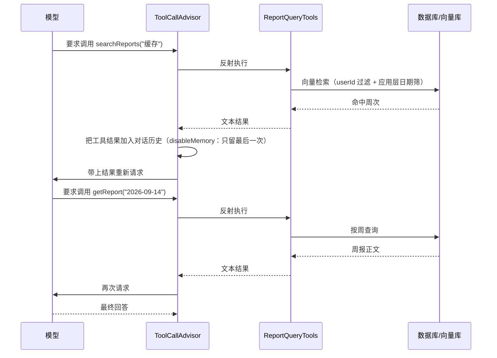

# 周报问答的工具调用：设计、实现与类比

> 适用范围：本项目 `WeeklyReportManager`，Spring AI **1.1.8**。
> 涉及代码：`service/tool/ReportQueryTools.java`、`service/tool/PlainTextResultConverter.java`、`service/AIService.java`。
> 官方依据：Spring AI Reference 1.1.8 — *Tool Calling*。
> 配套阅读：`spring-ai-framework-overview.md`（框架地图）、`spring-ai-chat-memory.md`（记忆机制，本文第七节与其呼应）。

---

## 一、类比：医生不能离开诊室

延续记忆文档里的诊所世界观。工具调用的核心约束是：

> **医生（模型）判断力很强，但他被物理限制在诊室里——不能自己去检验科、不能自己翻档案柜。**

他想知道什么，只能**开一张化验单**递出来：

```
"我要查 2026-09-07 那一周的病历。"   ← 这是工具调用请求（tool call）
```

单子递出去之后：

| 环节 | 谁在做 |
|---|---|
| 写单子、填参数 | **医生（模型）** |
| 拿单子去执行 | **护士（你的 Java 代码）** |
| 把结果递回给医生 | **护士** |

**医生从头到尾没有接触过档案柜。** 这就是 Spring AI 官方那句安全原则的通俗版：

> 工具调用虽然是模型能力，但**执行逻辑完全由客户端应用负责**。模型只能"请求调用并提供参数"，**模型永远无法访问被提供的任何 API**。

理解这一点，后面所有的安全设计就有了统一的解释：**能做的防护，就是"让医生压根开不出某种单子"。**

---

## 二、四个角色

| 类比中的东西 | 真实组件 | 职责 |
|---|---|---|
| **可开项目清单** | `@Tool` 注解标注的方法 | 登记"医生有权开哪些检查" |
| **化验单上的填写说明** | `@ToolParam` 注解 | 告诉模型每个参数填什么、什么格式 |
| **化验流程的调度台** | `ToolCallAdvisor` | 把"开单 → 执行 → 回诊"这个循环搬到可控的链上 |
| **化验单的报告格式** | `ToolCallResultConverter`（本项目自定义 `PlainTextResultConverter`） | 决定结果以什么形态回到医生手里 |

### 2.1 `@Tool` —— 登记"可开项目"

```java
@Tool(description = "列出用户在当前查询范围内已提交周报的周次清单（周一日期 + 标题）。"
        + "不确定某段时间有没有周报、或需要先知道有哪些周可查时先调用它。无参数。"
        + "查询范围由系统固定，范围外的周报这里看不到。",
        resultConverter = PlainTextResultConverter.class)
public String listSubmittedWeeks() {
```

要理解两件事：

**① `description` 不是给人看的，是给模型看的。** 官方明确提醒：**描述不佳会导致模型该用不用、或用错**。它在功能上等价于"化验项目的说明书"——医生不看代码，只看这段文字来决定"该开哪一项"。

**② 方法可以是任意可见性、任意返回类型**（含 `void`），因为框架是通过反射调用的。**JSON Schema 会自动生成**——你不需要手写参数结构。

### 2.2 `@ToolParam` —— 填写说明

```java
public String getReport(
        @ToolParam(description = "周一的日期，格式 yyyy-MM-dd") String weekStart) {
```

官方有一条容易忽视的提醒：

> 正确设置 `required` 对**抑制幻觉**至关重要。**若参数本可为空却被标记为必填，模型很可能编造一个值。**

默认所有参数都是必填，所以**真正可选的参数必须显式标记**，否则就是在邀请模型瞎填。

### 2.3 `ToolCallAdvisor` —— 调度台

这个组件存在的理由，项目注释写得很清楚：

```java
// 工具调用循环的 Advisor。为什么需要它：默认情况下工具是在 ChatModel 内部执行的
// （OpenAiChatModel.internalStream 里自己递归），那些 tool 消息不经过 advisor 链，
// AILogAdvisor 只能看到「一次请求 + 一个最终回答」，没法确认模型到底调没调工具、传了什么参数。
// ToolCallAdvisor 把循环搬到 advisor 链上（同时关掉模型内部的工具执行），每轮往返都会过一遍日志。
```

官方定义了**三种执行控制模式**：

| 模式 | 谁控制循环 | 特点 |
|---|---|---|
| 框架控制（默认） | `ChatModel` 内部递归 | 透明，但循环内的消息**不经过 advisor 链** |
| 用户控制 | 你的 `while` 循环 | 完全可控，需自己管理历史 |
| **Advisor 控制（本项目）** | `ToolCallAdvisor` | **兼具可观测性与可控性** |

### 2.4 `PlainTextResultConverter` —— 报告格式

```java
public class PlainTextResultConverter implements ToolCallResultConverter {
    @Override
    public String convert(@Nullable Object result, @Nullable Type returnType) {
        return result == null ? "" : result.toString();
    }
}
```

不自定义的话，默认的 `DefaultToolCallResultConverter` 会走 Jackson 序列化，把中文正文**加引号、换行转义成字面的 `\n`**。后果是 `ReportTextFormatter` 精心拼出来的多行块格式被压成一行——**模型读得懂，但 token 白花，格式信息也丢了**。

---

## 三、三个工具的分工

| 工具 | 参数 | 职责 | 什么时候用 |
|---|---|---|---|
| `listSubmittedWeeks` | 无 | 列出范围内**有哪些周**（周一日期 + 标题） | 不知道有哪些周可查时 |
| `getReport` | `weekStart` | 读**某一周的正文** | 已经知道确切周次时 |
| `searchReports` | `query` | **按语义**检索主题，返回命中的周次 | "不记得是哪一周"的模糊问题 |

三者构成两条典型路径：

```
模糊提问：searchReports("缓存")  →  拿到周次  →  getReport("2026-09-07")  →  作答
明确提问：getReport("2026-09-07")  →  作答
兜底路径：listSubmittedWeeks()  →  拿到周次  →  getReport(...)  →  作答
```

**注意 `searchReports` 只返回周次、不返回正文**——这是刻意的设计，下面第五节详细讲。

---

## 四、一次「开单 → 化验 → 回诊」的完整时序

以"我什么时候做过缓存相关的工作？"为例，实际日志长这样（`AILogAdvisor` 打印）：

```
│ [USER] 我什么时候做过缓存相关的工作？
│ [ASSISTANT]
│   ↳ 调用 searchReports({"query": "缓存 cache 相关工作"})
│ [TOOL]
│   ↳ searchReports 返回：语义检索命中（按相关度排序，周一日期）：
- 2026-09-14
- 2026-09-07
请用 getReport 读取其中相关周的正文后再回答。
│ [ASSISTANT]
│   ↳ 调用 getReport({"weekStart": "2026-09-14"})
│   ↳ 调用 getReport({"weekStart": "2026-09-07"})
│ [TOOL]
│   ↳ getReport 返回：【2026-09-14 09.14~09.18】总体进度：...
│   ↳ getReport 返回：【2026-09-07 09.07~09.11】总体进度：...
│ [ASSISTANT] 你在两个相邻的周次里做过缓存相关的工作：...
```



**关键点**：一次用户提问内部发生了 **3 次模型往返**。这就是"工具调用是命令式、会阻塞"的实际含义——它不像普通问答那样一次调用就结束。

---

## 五、六条安全护栏（本项目最核心的部分）

这一节是整个工具设计里最值得学的部分。**核心思路：能做的防护，就是让模型"开不出"越界的单子。**

### 护栏 1：`userId` 不进 schema（**最重要**）

```java
public class ReportQueryTools {

    private final Long userId;
    private final LocalDate startMonday;
    private final LocalDate endDate;
    private final WeeklyReportService weeklyReportService;
    private final VectorStore vectorStore;

    public ReportQueryTools(Long userId, LocalDate start, LocalDate end,
                            WeeklyReportService weeklyReportService, VectorStore vectorStore) {
        this.userId = userId;
        this.startMonday = DateUtils.getMondayOfWeek(start);
        this.endDate = end;
        ...
    }
```

类注释写明了这个原则：

```java
// 一次请求 new 一个，把「本次请求里可信的输入」全部钉成构造器字段、不进 schema：
// - userId：模型没有任何途径指定别人，越权查询在结构上就不可能
```

用化验单的比喻：**单子上根本没有"病人姓名"这一栏。** 医生想开别人的检查？他连在哪里填都不知道。

这和"给参数加校验"是完全不同层级的防护：

| 做法 | 防护强度 |
|---|---|
| 把 `userId` 做成 `@ToolParam`，在方法里校验它等于当前用户 | ❌ 模型可以传别人，只是被拒绝——**只要校验漏一次就出事** |
| **把 `userId` 钉成构造器字段，根本不进参数表** | ✅ 模型**没有途经**表达"查别人"，攻击面为零 |

### 护栏 2：日期范围同样钉死

```java
// - startMonday / endDate：用户在界面上选的时间范围（没选时由 AIService 算默认值）。
// 范围同样不让模型看见——它不需要知道，也正因为不知道，查不到范围外的数据
```

**为什么范围也必须钉死**——代码里记了一次真实回归：

```java
// 为什么范围必须钉进来：改成工具后出过一次「范围被静默丢弃」的回归——旧写法是按范围把周报查出来
// 直接塞进 prompt，范围是隐含生效的；换成工具后范围一度只剩「判断区间内有没有数据」这一个用途，
// 用户在弹窗里选 6 月、模型却完全不知道，只会照自己的猜测去查，答成「没有相关记录」。
```

这次的教训是：**从"塞上下文"改成"给工具"时，所有原本"隐含生效"的约束都会失效**——因为约束不再体现在数据里，而是要靠工具自己记得。

### 护栏 3：越界返回**可读提示**而不是抛异常

```java
if (monday.isBefore(startMonday) || monday.isAfter(endDate)) {
    return weekStart + " 不在本次查询范围（" + startMonday + " ~ " + endDate + "）内，"
            + "请改用范围内的日期，或告知用户这段时间没有数据。";
}
```

两种做法的差别：

| 做法 | 模型看到什么 | 结果 |
|---|---|---|
| 抛异常 | 一个错误堆栈 | 模型不知所措，或回复报错文案 |
| **返回可读提示** | **"这个日期不在范围内，请改用范围内的日期"** | 模型能据此改口，或直接告知用户 |

这与官方默认的错误处理策略一致：`throw-exception-on-error` **默认 `false`**，RuntimeException 的错误消息会**回传给模型**让它自行处理。

### 护栏 4：每次请求 `new` 一个实例

```java
.tools(new ReportQueryTools(request.getUserId(), start, end, weeklyReportService, vectorStore))
```

官方有一条容易踩的坑：

> 如果同时提供默认工具（`defaultTools`）与运行时工具，**运行时工具会完全覆盖默认工具**。默认工具在所有请求间共享，使用不当有风险。

本项目**从不使用 `defaultTools`**，每次请求都新建实例。好处：

- `userId` 等请求级数据**天然隔离**，不同请求之间不可能串；
- 不受"默认工具被覆盖"这条规则的影响。

### 护栏 5：token 预算（三个上限）

工具输出同样烧 token，而且工具版**可能比截断版更贵**。所以设了三道闸：

| 常量 | 值 | 防什么 |
|---|---|---|
| `MAX_TOOL_BODY_CHARS` | 3000 | 单次 `getReport` 返回的正文上限 |
| `MAX_CATALOG_WEEKS` | 60 | 目录最多列多少周（10 年 ≈ 520 行 ≈ 13KB） |
| `SEARCH_TOP_K` / `MAX_HITS` | 20 / 5 | 向量检索先多召回、筛完日期后只返回 5 条 |

`MAX_CATALOG_WEEKS` 的注释里还有一条重要的设计原则：

```java
// 超出时保留最近的（列表按 week_start_date 升序，最近的就在尾部），并在开头写明丢了多少，
// 与 ReportTextFormatter#context 是同一个原则：宁可说清「没给你看」，也不能让模型以为「不存在」。
```

**"我没给你看" 和 "它不存在" 必须区分开**，否则模型会把截断误答成"没有记录"。

### 护栏 6：工具描述本身就写着约束

```java
@Tool(description = "列出用户在当前查询范围内已提交周报的周次清单（周一日期 + 标题）。"
        + "..."
        + "查询范围由系统固定，范围外的周报这里看不到。")
```

描述里主动声明"范围外看不到"，是**降低模型乱试概率**的软约束——硬约束是护栏 1、2，软约束是减少无谓的往返。

---

## 六、为什么用 `ToolCallAdvisor` 而不是默认的内部执行

三个实际收益：

**① 可观测性** —— 这是选它的直接原因。默认模式下，工具在 `ChatModel` 内部递归执行，那些 tool 消息**不经过 advisor 链**，`AILogAdvisor` 只能看到"一次请求 + 一个最终回答"。搬到链上之后，**每轮往返都会过一遍日志**。

**② 与 `ChatMemory` 集成** —— 官方原文：与对话历史管理无缝配合。

**③ 可扩展** —— 可以定制工具调用行为（比如加拦截、加审计）。

配置上有两个细节：

```java
this.toolCallAdvisor = ToolCallAdvisor.builder()
        .disableMemory()
        .suppressToolCallStreaming()
        .build();
```

| 选项 | 作用 | 不设的后果 |
|---|---|---|
| `disableMemory()` | 只把**最后一次工具响应**传给下一轮 | 与 `memoryAdvisor` **两本账**，历史重复 |
| `suppressToolCallStreaming()` | 只把最终回答推给前端 | 工具调用那一轮的 chunk 漏进 SSE，**前端把工具 JSON 当正文渲染** |

`suppressToolCallStreaming()` 的注释多了一句提醒：

```java
// 显式写出来是因为 Builder 的字段默认值
// 和它自己的 javadoc 说法不一致，不能赌
```

这是一条很实用的经验：**框架默认值与文档不一致时，显式声明永远比赌默认值安全。**

---

## 七、与记忆的配合（呼应记忆文档）

工具调用和记忆有两处关键交互：

**① `disableMemory()` 避免双份历史**（见上）。`ChatMemory` 是历史的唯一管理者。

**② 工具响应不进记忆。** 记忆只沉淀 user / assistant 两类消息，而工具结果出现在 `TOOL` 消息里——**所以它不会随轮次累积**。

这正是"周报原文走工具按需查"的价值所在：如果原文被拼进 **user 消息**，它就会被逐轮写进记忆，第 5 轮时模型要读 5 份完整原文，token 和延迟**平方级上涨**。

---

## 八、官方限制（写工具时必看）

**方法工具（`@Tool`）不支持的参数/返回类型**：

- `Optional`
- 异步类型（`CompletableFuture`、`Future`）
- 响应式类型（`Flow`、`Mono`、`Flux`）
- 函数式类型（`Function`、`Supplier`、`Consumer`）

**函数工具（`FunctionToolCallback`）不支持**：基本类型、`Optional`、集合类型（`List`/`Map`/`Array`/`Set`）、异步与响应式类型。

> 注意：基本类型与集合类型在**基于方法的规格中是支持的**——本项目三个工具返回的 `String` 没有任何限制问题。

**其他**：

- 工具名在同一次请求内必须唯一
- **返回值必须可序列化**
- 默认情况下，与模型交换的**内部工具执行消息不暴露给用户**
- `@Tool` 标注的类若不是 Spring Bean（如本项目的 `ReportQueryTools` 是手动 `new` 的），**AOT/GraalVM 场景需要额外配置**

---

## 九、验证方法

| 验证项 | 怎么测 | 期望 |
|---|---|---|
| 工具被选中 | 问"我什么时候做过 X？" | 日志出现 `↳ 调用 searchReports(...)` |
| 参数正确 | 看日志里工具调用的参数 | query 是自然语言，`getReport` 的日期是**工具返回过的**真实周一 |
| 两步链路 | 看是否 `searchReports` 后接 `getReport` | 检索定位 → 读全文 |
| **用户隔离** | 用 userId=2 问 userId=1 写过的主题 | **必须查不到** |
| **范围约束** | 选一个早于目标周的区间再问 | 必须查不到 |
| 越界不炸 | 让模型试一个范围外的日期 | 返回可读提示，不是异常 |
| 流式干净 | 观察前端输出 | 不能出现工具调用的 JSON |

**日志是主战场**：`AILogAdvisor` 需要能打印工具名和参数（见第十节坑 1）。

---

## 十、踩过的坑

### 坑 1：`AILogAdvisor` 看不到工具调用

`[TOOL]` 后面打印出空白，完全不知道模型调了什么、传了什么参数。

**原因**：日志只打印了 `message.getText()`，而：

| 消息类型 | 内容在哪 | `getText()` |
|---|---|---|
| `ASSISTANT`（含工具调用） | `getToolCalls()` | 空 |
| `TOOL`（工具返回） | `getResponses()` | 空 |

**修复**：遍历消息时针对这两种类型补打印。这是**做工具调用调试的前提**——没有它，一切只能靠猜。

### 坑 2：空结果文案会诱导模型"偷懒"

工具返回空时，如果文案里给了"或告知用户没有相关记录"这种出口，模型会**顺着捷径直接下结论**，跳过本该做的复核。

真实案例：模型没调 `getReport` 读正文，就断言"其中都没有提到缓存相关的内容"——**这是编造**。

**修复**：把出口堵掉，改成强制复核：

```java
return "在 " + startMonday + " ~ " + endDate + " 范围内没有语义检索命中。"
        + "注意：这不等于「用户没做过相关工作」，语义检索可能漏召。"
        + "请改用 listSubmittedWeeks 查看该范围内有哪些周报，"
        + "再挑时间或标题上可能相关的几周用 getReport 读正文核实，"
        + "确认后再回答；不要仅凭本工具的空结果就断言「没有相关记录」。";
```

**教训**：**工具的返回文案会直接塑造模型行为**。它不像代码报错那样显眼，而是产生一个"看起来完全合理的错误答案"。

### 坑 3：流式下工具 JSON 漏到前端

`suppressToolCallStreaming()` 的作用。不显式打开时，工具调用那一轮的 chunk 会被前端当正文渲染出来。

### 坑 4：从"塞上下文"改到"给工具"时，隐含约束全丢

见护栏 2 里记录的那次回归——范围一度只剩"判断区间内有没有数据"一个用途，用户选了 6 月，模型却完全不知道。

**教训**：改造时要把所有"原本隐含在数据里的约束"逐条列出来，重新在工具侧落实。

---

## 附：一句话速记

1. **模型只能开单，不能自己去执行**——所有安全设计都围绕"让他开不出越界的单子"。
2. **请求级的可信输入钉进构造器，不进 schema**，这是比参数校验更强的防护。
3. **`description` 是写给人看的还是给模型看的？给模型的**——它直接决定工具会不会被正确使用。
4. **工具返回可读提示，不要抛异常**（与官方 `throw-exception-on-error=false` 一致）。
5. **每次请求 new 一个工具实例**，不用 `defaultTools`。
6. **工具输出要有 token 预算**，并区分"没给你看"和"不存在"。
7. **`ToolCallAdvisor` + `disableMemory` + `suppressToolCallStreaming`** 是流式工具调用的三件套。
8. **工具的返回文案会塑造模型行为**——空结果尤其危险。
